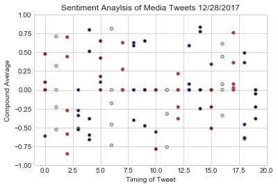
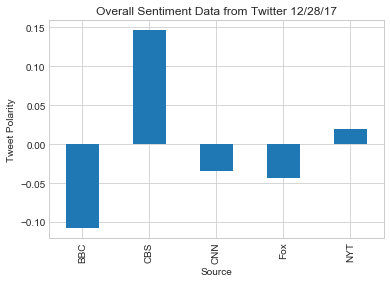

```python
import tweepy
import pandas as pd
import json
import numpy as np
import matplotlib.pyplot as plt
import seaborn as sns
from vaderSentiment.vaderSentiment import SentimentIntensityAnalyzer
analyzer = SentimentIntensityAnalyzer()

```


```python
# Twitter API Keys

consumer_key = "XPKCWiE4tAtmufESqP94hXTuY"
consumer_secret = "Hu0NtIffajdG22DlFPiur8gBd8t2MQeBWEwRrl48qRCT2v9Kf4"
access_token = "20581045-BpJ4v1k01C83x0cQDCmlXckCh4DbYL6Mkyw6ulFEV"
access_token_secret = "cmP0b4ESMcs4p9201gY4KYIkw5pacfTeRD5ofLKveSvqm"
```


```python
# Setup Tweepy API Authentication

auth = tweepy.OAuthHandler(consumer_key, consumer_secret)
auth.set_access_token(access_token, access_token_secret)
api = tweepy.API(auth, parser=tweepy.parsers.JSONParser())
```


```python
#Get user names

BBC = "@BBCWorld"
CBS = "@CBSNews"
CNN = "@CNN"
Fox = "@FoxNews"
NYT = "@nytimes"
```


```python
#Get BBC Tweets

# Counter
counter = 1

# Loop through 5 pages of tweets (total 100 tweets)
for x in range(5):

    # Get all tweets from home feed
    BBCTweets = api.user_timeline(BBC)

    # Loop through all tweets
    for tweet in BBCTweets:

        # Print Tweets
        print("Tweet %s: %s" % (counter, tweet["text"]))

        # Add to Counter
        counter = counter + 1
```

    Tweet 1: RT @BBCBreaking: Massive fire breaks out at popular Mumbai complex, killing at least 14 people, officials say: https://t.co/JM3qSBfYgG
    Tweet 2: RT @BBCNewsAsia: A round of applause for this forest guard in southern India, who just saved a baby elephant that fell into a ditch!
    
    🐘👏👏👏:…
    Tweet 3: RT @BBCNewsAsia: In Afghanistan, young women are reportedly being subjected to degrading virginity tests: https://t.co/kaOfIvl9Zd https://t…
    Tweet 4: Justine Damond: US prosecutor delays decision on charges https://t.co/benciXqRnR
    Tweet 5: Elephant rescue https://t.co/Cv9JVGiW1W
    Tweet 6: Exporting doctors https://t.co/7Wx3qWa4Ui
    Tweet 7: A matter of shame https://t.co/r4wgQXGpOl
    Tweet 8: Path to legalisation https://t.co/x8x7kEXUSV
    Tweet 9: Africa's year in pictures 2017 https://t.co/otwkE4Vjap
    Tweet 10: Brazilian fishermen work with dolphins to round up their catch https://t.co/KsciUW8S0F
    Tweet 11: Italy dissolves parliament for March election https://t.co/f7oTYJicYA
    Tweet 12: Apple apologies for slowing iPhone batteries down https://t.co/7vYdkyi5xj
    Tweet 13: Apple apologies for slowing iPhone batteries down 
    https://t.co/R9kvLPW7hU
    Tweet 14: Japan's Softbank takes large stake in Uber https://t.co/apzznbMvyy
    Tweet 15: Iranians protest against high prices in Mashhad https://t.co/1yxKtfZjC4
    Tweet 16: Flight to nowhere https://t.co/RgOe7RDNK9
    Tweet 17: President Nicolás Maduro of Venezuela accuses Portugal of sabotaging pork deliveries in time for Christmas https://t.co/Hgm3MOPOFX
    Tweet 18: Vanity Fair sorry for suggesting Hillary Clinton 'knit' 
    https://t.co/HwnTGErLOA
    Tweet 19: Dissolving the dead: An alternative to burial or cremation https://t.co/1p4WDsHd2V
    Tweet 20: Alabama certifies election despite last-ditch Roy Moore lawsuit https://t.co/oRvnV7ALHz
    Tweet 21: RT @BBCBreaking: Massive fire breaks out at popular Mumbai complex, killing at least 14 people, officials say: https://t.co/JM3qSBfYgG
    Tweet 22: RT @BBCNewsAsia: A round of applause for this forest guard in southern India, who just saved a baby elephant that fell into a ditch!
    
    🐘👏👏👏:…
    Tweet 23: RT @BBCNewsAsia: In Afghanistan, young women are reportedly being subjected to degrading virginity tests: https://t.co/kaOfIvl9Zd https://t…
    Tweet 24: Justine Damond: US prosecutor delays decision on charges https://t.co/benciXqRnR
    Tweet 25: Elephant rescue https://t.co/Cv9JVGiW1W
    Tweet 26: Exporting doctors https://t.co/7Wx3qWa4Ui
    Tweet 27: A matter of shame https://t.co/r4wgQXGpOl
    Tweet 28: Path to legalisation https://t.co/x8x7kEXUSV
    Tweet 29: Africa's year in pictures 2017 https://t.co/otwkE4Vjap
    Tweet 30: Brazilian fishermen work with dolphins to round up their catch https://t.co/KsciUW8S0F
    Tweet 31: Italy dissolves parliament for March election https://t.co/f7oTYJicYA
    Tweet 32: Apple apologies for slowing iPhone batteries down https://t.co/7vYdkyi5xj
    Tweet 33: Apple apologies for slowing iPhone batteries down 
    https://t.co/R9kvLPW7hU
    Tweet 34: Japan's Softbank takes large stake in Uber https://t.co/apzznbMvyy
    Tweet 35: Iranians protest against high prices in Mashhad https://t.co/1yxKtfZjC4
    Tweet 36: Flight to nowhere https://t.co/RgOe7RDNK9
    Tweet 37: President Nicolás Maduro of Venezuela accuses Portugal of sabotaging pork deliveries in time for Christmas https://t.co/Hgm3MOPOFX
    Tweet 38: Vanity Fair sorry for suggesting Hillary Clinton 'knit' 
    https://t.co/HwnTGErLOA
    Tweet 39: Dissolving the dead: An alternative to burial or cremation https://t.co/1p4WDsHd2V
    Tweet 40: Alabama certifies election despite last-ditch Roy Moore lawsuit https://t.co/oRvnV7ALHz
    Tweet 41: RT @BBCBreaking: Massive fire breaks out at popular Mumbai complex, killing at least 14 people, officials say: https://t.co/JM3qSBfYgG
    Tweet 42: RT @BBCNewsAsia: A round of applause for this forest guard in southern India, who just saved a baby elephant that fell into a ditch!
    
    🐘👏👏👏:…
    Tweet 43: RT @BBCNewsAsia: In Afghanistan, young women are reportedly being subjected to degrading virginity tests: https://t.co/kaOfIvl9Zd https://t…
    Tweet 44: Justine Damond: US prosecutor delays decision on charges https://t.co/benciXqRnR
    Tweet 45: Elephant rescue https://t.co/Cv9JVGiW1W
    Tweet 46: Exporting doctors https://t.co/7Wx3qWa4Ui
    Tweet 47: A matter of shame https://t.co/r4wgQXGpOl
    Tweet 48: Path to legalisation https://t.co/x8x7kEXUSV
    Tweet 49: Africa's year in pictures 2017 https://t.co/otwkE4Vjap
    Tweet 50: Brazilian fishermen work with dolphins to round up their catch https://t.co/KsciUW8S0F
    Tweet 51: Italy dissolves parliament for March election https://t.co/f7oTYJicYA
    Tweet 52: Apple apologies for slowing iPhone batteries down https://t.co/7vYdkyi5xj
    Tweet 53: Apple apologies for slowing iPhone batteries down 
    https://t.co/R9kvLPW7hU
    Tweet 54: Japan's Softbank takes large stake in Uber https://t.co/apzznbMvyy
    Tweet 55: Iranians protest against high prices in Mashhad https://t.co/1yxKtfZjC4
    Tweet 56: Flight to nowhere https://t.co/RgOe7RDNK9
    Tweet 57: President Nicolás Maduro of Venezuela accuses Portugal of sabotaging pork deliveries in time for Christmas https://t.co/Hgm3MOPOFX
    Tweet 58: Vanity Fair sorry for suggesting Hillary Clinton 'knit' 
    https://t.co/HwnTGErLOA
    Tweet 59: Dissolving the dead: An alternative to burial or cremation https://t.co/1p4WDsHd2V
    Tweet 60: Alabama certifies election despite last-ditch Roy Moore lawsuit https://t.co/oRvnV7ALHz
    Tweet 61: RT @BBCBreaking: Massive fire breaks out at popular Mumbai complex, killing at least 14 people, officials say: https://t.co/JM3qSBfYgG
    Tweet 62: RT @BBCNewsAsia: A round of applause for this forest guard in southern India, who just saved a baby elephant that fell into a ditch!
    
    🐘👏👏👏:…
    Tweet 63: RT @BBCNewsAsia: In Afghanistan, young women are reportedly being subjected to degrading virginity tests: https://t.co/kaOfIvl9Zd https://t…
    Tweet 64: Justine Damond: US prosecutor delays decision on charges https://t.co/benciXqRnR
    Tweet 65: Elephant rescue https://t.co/Cv9JVGiW1W
    Tweet 66: Exporting doctors https://t.co/7Wx3qWa4Ui
    Tweet 67: A matter of shame https://t.co/r4wgQXGpOl
    Tweet 68: Path to legalisation https://t.co/x8x7kEXUSV
    Tweet 69: Africa's year in pictures 2017 https://t.co/otwkE4Vjap
    Tweet 70: Brazilian fishermen work with dolphins to round up their catch https://t.co/KsciUW8S0F
    Tweet 71: Italy dissolves parliament for March election https://t.co/f7oTYJicYA
    Tweet 72: Apple apologies for slowing iPhone batteries down https://t.co/7vYdkyi5xj
    Tweet 73: Apple apologies for slowing iPhone batteries down 
    https://t.co/R9kvLPW7hU
    Tweet 74: Japan's Softbank takes large stake in Uber https://t.co/apzznbMvyy
    Tweet 75: Iranians protest against high prices in Mashhad https://t.co/1yxKtfZjC4
    Tweet 76: Flight to nowhere https://t.co/RgOe7RDNK9
    Tweet 77: President Nicolás Maduro of Venezuela accuses Portugal of sabotaging pork deliveries in time for Christmas https://t.co/Hgm3MOPOFX
    Tweet 78: Vanity Fair sorry for suggesting Hillary Clinton 'knit' 
    https://t.co/HwnTGErLOA
    Tweet 79: Dissolving the dead: An alternative to burial or cremation https://t.co/1p4WDsHd2V
    Tweet 80: Alabama certifies election despite last-ditch Roy Moore lawsuit https://t.co/oRvnV7ALHz
    Tweet 81: RT @BBCBreaking: Massive fire breaks out at popular Mumbai complex, killing at least 14 people, officials say: https://t.co/JM3qSBfYgG
    Tweet 82: RT @BBCNewsAsia: A round of applause for this forest guard in southern India, who just saved a baby elephant that fell into a ditch!
    
    🐘👏👏👏:…
    Tweet 83: RT @BBCNewsAsia: In Afghanistan, young women are reportedly being subjected to degrading virginity tests: https://t.co/kaOfIvl9Zd https://t…
    Tweet 84: Justine Damond: US prosecutor delays decision on charges https://t.co/benciXqRnR
    Tweet 85: Elephant rescue https://t.co/Cv9JVGiW1W
    Tweet 86: Exporting doctors https://t.co/7Wx3qWa4Ui
    Tweet 87: A matter of shame https://t.co/r4wgQXGpOl
    Tweet 88: Path to legalisation https://t.co/x8x7kEXUSV
    Tweet 89: Africa's year in pictures 2017 https://t.co/otwkE4Vjap
    Tweet 90: Brazilian fishermen work with dolphins to round up their catch https://t.co/KsciUW8S0F
    Tweet 91: Italy dissolves parliament for March election https://t.co/f7oTYJicYA
    Tweet 92: Apple apologies for slowing iPhone batteries down https://t.co/7vYdkyi5xj
    Tweet 93: Apple apologies for slowing iPhone batteries down 
    https://t.co/R9kvLPW7hU
    Tweet 94: Japan's Softbank takes large stake in Uber https://t.co/apzznbMvyy
    Tweet 95: Iranians protest against high prices in Mashhad https://t.co/1yxKtfZjC4
    Tweet 96: Flight to nowhere https://t.co/RgOe7RDNK9
    Tweet 97: President Nicolás Maduro of Venezuela accuses Portugal of sabotaging pork deliveries in time for Christmas https://t.co/Hgm3MOPOFX
    Tweet 98: Vanity Fair sorry for suggesting Hillary Clinton 'knit' 
    https://t.co/HwnTGErLOA
    Tweet 99: Dissolving the dead: An alternative to burial or cremation https://t.co/1p4WDsHd2V
    Tweet 100: Alabama certifies election despite last-ditch Roy Moore lawsuit https://t.co/oRvnV7ALHz


```python
#Getting Vader Anaslysis for BBC Tweets
from pandas import Series, DataFrame

tweet = []
vs_compound = []
vs_pos = []
vs_neu = []
vs_neg = []

for i in range(0, len(BBCTweets)):
    tweet.append(BBCTweets[i]['text'])
    vs_compound.append(analyzer.polarity_scores(BBCTweets[i]['text'])['compound'])
    vs_pos.append(analyzer.polarity_scores(BBCTweets[i]['text'])['pos'])
    vs_neu.append(analyzer.polarity_scores(BBCTweets[i]['text'])['neu'])
    vs_neg.append(analyzer.polarity_scores(BBCTweets[i]['text'])['neg'])
    
    BBC_df = DataFrame({'Tweet': tweet,
                        'Compound': vs_compound,
                        'Positive': vs_pos,
                        'Neutral': vs_neu,
                        'Negative': vs_neg})
BBC_df = BBC_df[['Tweet', 'Compound','Positive', 'Neutral', 'Negative']]

BBC_df['Source'] = 'BBC'
BBC_df['Counter'] = range(len(BBC_df))

# Top 5 results.
BBC_df.head()
```


<div>
<style>
    .dataframe thead tr:only-child th {
        text-align: right;
    }

    .dataframe thead th {
        text-align: left;
    }

    .dataframe tbody tr th {
        vertical-align: top;
    }
</style>
<table border="1" class="dataframe">
  <thead>
    <tr style="text-align: right;">
      <th></th>
      <th>Tweet</th>
      <th>Compound</th>
      <th>Positive</th>
      <th>Neutral</th>
      <th>Negative</th>
      <th>Source</th>
      <th>Counter</th>
    </tr>
  </thead>
  <tbody>
    <tr>
      <th>0</th>
      <td>RT @BBCBreaking: Massive fire breaks out at po...</td>
      <td>-0.6124</td>
      <td>0.114</td>
      <td>0.610</td>
      <td>0.276</td>
      <td>BBC</td>
      <td>0</td>
    </tr>
    <tr>
      <th>1</th>
      <td>RT @BBCNewsAsia: A round of applause for this ...</td>
      <td>0.7088</td>
      <td>0.228</td>
      <td>0.772</td>
      <td>0.000</td>
      <td>BBC</td>
      <td>1</td>
    </tr>
    <tr>
      <th>2</th>
      <td>RT @BBCNewsAsia: In Afghanistan, young women a...</td>
      <td>-0.5859</td>
      <td>0.000</td>
      <td>0.798</td>
      <td>0.202</td>
      <td>BBC</td>
      <td>2</td>
    </tr>
    <tr>
      <th>3</th>
      <td>Justine Damond: US prosecutor delays decision ...</td>
      <td>-0.2732</td>
      <td>0.000</td>
      <td>0.792</td>
      <td>0.208</td>
      <td>BBC</td>
      <td>3</td>
    </tr>
    <tr>
      <th>4</th>
      <td>Elephant rescue https://t.co/Cv9JVGiW1W</td>
      <td>0.5106</td>
      <td>0.623</td>
      <td>0.377</td>
      <td>0.000</td>
      <td>BBC</td>
      <td>4</td>
    </tr>
  </tbody>
</table>
</div>


```python
#Get CBS Tweets

# Counter
counter = 1

# Loop through 5 pages of tweets (total 100 tweets)
for x in range(5):

    # Get all tweets from home feed
    CBSTweets = api.user_timeline(CBS)

    # Loop through all tweets
    for tweet in CBSTweets:

        # Print Tweets
        print("Tweet %s: %s" % (counter, tweet["text"]))

        # Add to Counter
        counter = counter + 1
```

    Tweet 1: After 8-day uproar since news first broke that Apple intentionally slowed down older iPhone models to save battery… https://t.co/4BwE2TXfcU
    Tweet 2: "Here is my promise to you: I may be leaving the Senate, but I am not giving up my voice." Al Franken addresses sup… https://t.co/T0EHk4itrl
    Tweet 3: Rose Marie, the wisecracking Sally Rogers of "The Dick Van Dyke Show," is dead at 94 https://t.co/0HDsYdwsaq https://t.co/uKd6n18mvL
    Tweet 4: About 40,000 pounds of avocados spilled onto a Texas highway Thursday after an 18-wheeler hauling them caught fire. https://t.co/ZHJzHntHWQ
    Tweet 5: Man arrested for allegedly biting off part of relative's ear during drunken confrontation on Christmas Eve, police… https://t.co/7leWLXSjZd
    Tweet 6: Airlines are testing new technology to improve security and speed up the boarding process. That includes new biomet… https://t.co/auznTGB1av
    Tweet 7: "The takeaway from our preparation is this: people will be safe and should feel safe too." NYPD promises to step up… https://t.co/ReSRQzOnSq
    Tweet 8: RT @CBSEveningNews: Everyone knows America loves a winner
    
    But @JamieYuccas found a place where they always raise a glass -- to the loser h…
    Tweet 9: In South Carolina, many who thought they hit the lottery — well, they're out of luck. https://t.co/vf24WMH7wL
    Tweet 10: Airlines are testing new technology to improve security and speed up the boarding process. Soon, you may have to sh… https://t.co/frpSS43AIJ
    Tweet 11: At the height of this busy travel season, the @TSA posted photos Thursday of the arsenal of prohibited items people… https://t.co/Blqo90But2
    Tweet 12: RT @CBSEveningNews: Given today's attack in Kabul, does ISIS in Afghanistan pose a threat to the US similar to that of ISIS in Iraq and Syr…
    Tweet 13: In the nation's capital, this charity serves hundreds of meals daily to the needy, operating largely through charit… https://t.co/MJc8asjfc7
    Tweet 14: Democrat Doug Jones officially declared winner of Alabama Senate race against Republican Judge Roy Moore https://t.co/rHK0TanUfq
    Tweet 15: RT @CBSEveningNews: Will these arctic temperatures continue?
    
    @DanielleWBZ4, meteorologist at @cbsboston, on what you can expect going into…
    Tweet 16: Three days before the ball drops in Times Square, security is already building up, @tonydokoupil reports. https://t.co/6ihRneiswN
    Tweet 17: RT @CBSEveningNews: We’re on the air in the East.@biannagolodryga is live from Studio 57 in NYC. 
    Thanks for being with us #RealReporting #…
    Tweet 18: Apple apologizes for slowing down old iPhones, offers $29 battery replacements https://t.co/mQ4LPnPk1F https://t.co/LZlgyU5Peg
    Tweet 19: RT @CBSEveningNews: COMING UP 
    
    Biometrics – things like your fingerprint and your face scan – are being used increasingly by the airlines…
    Tweet 20: A Confederate statue in Tennessee was vandalized with pink paint, but the owner says he plans to keep it that way —… https://t.co/g9KsSCiXZ2
    Tweet 21: After 8-day uproar since news first broke that Apple intentionally slowed down older iPhone models to save battery… https://t.co/4BwE2TXfcU
    Tweet 22: "Here is my promise to you: I may be leaving the Senate, but I am not giving up my voice." Al Franken addresses sup… https://t.co/T0EHk4itrl
    Tweet 23: Rose Marie, the wisecracking Sally Rogers of "The Dick Van Dyke Show," is dead at 94 https://t.co/0HDsYdwsaq https://t.co/uKd6n18mvL
    Tweet 24: About 40,000 pounds of avocados spilled onto a Texas highway Thursday after an 18-wheeler hauling them caught fire. https://t.co/ZHJzHntHWQ
    Tweet 25: Man arrested for allegedly biting off part of relative's ear during drunken confrontation on Christmas Eve, police… https://t.co/7leWLXSjZd
    Tweet 26: Airlines are testing new technology to improve security and speed up the boarding process. That includes new biomet… https://t.co/auznTGB1av
    Tweet 27: "The takeaway from our preparation is this: people will be safe and should feel safe too." NYPD promises to step up… https://t.co/ReSRQzOnSq
    Tweet 28: RT @CBSEveningNews: Everyone knows America loves a winner
    
    But @JamieYuccas found a place where they always raise a glass -- to the loser h…
    Tweet 29: In South Carolina, many who thought they hit the lottery — well, they're out of luck. https://t.co/vf24WMH7wL
    Tweet 30: Airlines are testing new technology to improve security and speed up the boarding process. Soon, you may have to sh… https://t.co/frpSS43AIJ
    Tweet 31: At the height of this busy travel season, the @TSA posted photos Thursday of the arsenal of prohibited items people… https://t.co/Blqo90But2
    Tweet 32: RT @CBSEveningNews: Given today's attack in Kabul, does ISIS in Afghanistan pose a threat to the US similar to that of ISIS in Iraq and Syr…
    Tweet 33: In the nation's capital, this charity serves hundreds of meals daily to the needy, operating largely through charit… https://t.co/MJc8asjfc7
    Tweet 34: Democrat Doug Jones officially declared winner of Alabama Senate race against Republican Judge Roy Moore https://t.co/rHK0TanUfq
    Tweet 35: RT @CBSEveningNews: Will these arctic temperatures continue?
    
    @DanielleWBZ4, meteorologist at @cbsboston, on what you can expect going into…
    Tweet 36: Three days before the ball drops in Times Square, security is already building up, @tonydokoupil reports. https://t.co/6ihRneiswN
    Tweet 37: RT @CBSEveningNews: We’re on the air in the East.@biannagolodryga is live from Studio 57 in NYC. 
    Thanks for being with us #RealReporting #…
    Tweet 38: Apple apologizes for slowing down old iPhones, offers $29 battery replacements https://t.co/mQ4LPnPk1F https://t.co/LZlgyU5Peg
    Tweet 39: RT @CBSEveningNews: COMING UP 
    
    Biometrics – things like your fingerprint and your face scan – are being used increasingly by the airlines…
    Tweet 40: A Confederate statue in Tennessee was vandalized with pink paint, but the owner says he plans to keep it that way —… https://t.co/g9KsSCiXZ2
    Tweet 41: After 8-day uproar since news first broke that Apple intentionally slowed down older iPhone models to save battery… https://t.co/4BwE2TXfcU
    Tweet 42: "Here is my promise to you: I may be leaving the Senate, but I am not giving up my voice." Al Franken addresses sup… https://t.co/T0EHk4itrl
    Tweet 43: Rose Marie, the wisecracking Sally Rogers of "The Dick Van Dyke Show," is dead at 94 https://t.co/0HDsYdwsaq https://t.co/uKd6n18mvL
    Tweet 44: About 40,000 pounds of avocados spilled onto a Texas highway Thursday after an 18-wheeler hauling them caught fire. https://t.co/ZHJzHntHWQ
    Tweet 45: Man arrested for allegedly biting off part of relative's ear during drunken confrontation on Christmas Eve, police… https://t.co/7leWLXSjZd
    Tweet 46: Airlines are testing new technology to improve security and speed up the boarding process. That includes new biomet… https://t.co/auznTGB1av
    Tweet 47: "The takeaway from our preparation is this: people will be safe and should feel safe too." NYPD promises to step up… https://t.co/ReSRQzOnSq
    Tweet 48: RT @CBSEveningNews: Everyone knows America loves a winner
    
    But @JamieYuccas found a place where they always raise a glass -- to the loser h…
    Tweet 49: In South Carolina, many who thought they hit the lottery — well, they're out of luck. https://t.co/vf24WMH7wL
    Tweet 50: Airlines are testing new technology to improve security and speed up the boarding process. Soon, you may have to sh… https://t.co/frpSS43AIJ
    Tweet 51: At the height of this busy travel season, the @TSA posted photos Thursday of the arsenal of prohibited items people… https://t.co/Blqo90But2
    Tweet 52: RT @CBSEveningNews: Given today's attack in Kabul, does ISIS in Afghanistan pose a threat to the US similar to that of ISIS in Iraq and Syr…
    Tweet 53: In the nation's capital, this charity serves hundreds of meals daily to the needy, operating largely through charit… https://t.co/MJc8asjfc7
    Tweet 54: Democrat Doug Jones officially declared winner of Alabama Senate race against Republican Judge Roy Moore https://t.co/rHK0TanUfq
    Tweet 55: RT @CBSEveningNews: Will these arctic temperatures continue?
    
    @DanielleWBZ4, meteorologist at @cbsboston, on what you can expect going into…
    Tweet 56: Three days before the ball drops in Times Square, security is already building up, @tonydokoupil reports. https://t.co/6ihRneiswN
    Tweet 57: RT @CBSEveningNews: We’re on the air in the East.@biannagolodryga is live from Studio 57 in NYC. 
    Thanks for being with us #RealReporting #…
    Tweet 58: Apple apologizes for slowing down old iPhones, offers $29 battery replacements https://t.co/mQ4LPnPk1F https://t.co/LZlgyU5Peg
    Tweet 59: RT @CBSEveningNews: COMING UP 
    
    Biometrics – things like your fingerprint and your face scan – are being used increasingly by the airlines…
    Tweet 60: A Confederate statue in Tennessee was vandalized with pink paint, but the owner says he plans to keep it that way —… https://t.co/g9KsSCiXZ2
    Tweet 61: After 8-day uproar since news first broke that Apple intentionally slowed down older iPhone models to save battery… https://t.co/4BwE2TXfcU
    Tweet 62: "Here is my promise to you: I may be leaving the Senate, but I am not giving up my voice." Al Franken addresses sup… https://t.co/T0EHk4itrl
    Tweet 63: Rose Marie, the wisecracking Sally Rogers of "The Dick Van Dyke Show," is dead at 94 https://t.co/0HDsYdwsaq https://t.co/uKd6n18mvL
    Tweet 64: About 40,000 pounds of avocados spilled onto a Texas highway Thursday after an 18-wheeler hauling them caught fire. https://t.co/ZHJzHntHWQ
    Tweet 65: Man arrested for allegedly biting off part of relative's ear during drunken confrontation on Christmas Eve, police… https://t.co/7leWLXSjZd
    Tweet 66: Airlines are testing new technology to improve security and speed up the boarding process. That includes new biomet… https://t.co/auznTGB1av
    Tweet 67: "The takeaway from our preparation is this: people will be safe and should feel safe too." NYPD promises to step up… https://t.co/ReSRQzOnSq
    Tweet 68: RT @CBSEveningNews: Everyone knows America loves a winner
    
    But @JamieYuccas found a place where they always raise a glass -- to the loser h…
    Tweet 69: In South Carolina, many who thought they hit the lottery — well, they're out of luck. https://t.co/vf24WMH7wL
    Tweet 70: Airlines are testing new technology to improve security and speed up the boarding process. Soon, you may have to sh… https://t.co/frpSS43AIJ
    Tweet 71: At the height of this busy travel season, the @TSA posted photos Thursday of the arsenal of prohibited items people… https://t.co/Blqo90But2
    Tweet 72: RT @CBSEveningNews: Given today's attack in Kabul, does ISIS in Afghanistan pose a threat to the US similar to that of ISIS in Iraq and Syr…
    Tweet 73: In the nation's capital, this charity serves hundreds of meals daily to the needy, operating largely through charit… https://t.co/MJc8asjfc7
    Tweet 74: Democrat Doug Jones officially declared winner of Alabama Senate race against Republican Judge Roy Moore https://t.co/rHK0TanUfq
    Tweet 75: RT @CBSEveningNews: Will these arctic temperatures continue?
    
    @DanielleWBZ4, meteorologist at @cbsboston, on what you can expect going into…
    Tweet 76: Three days before the ball drops in Times Square, security is already building up, @tonydokoupil reports. https://t.co/6ihRneiswN
    Tweet 77: RT @CBSEveningNews: We’re on the air in the East.@biannagolodryga is live from Studio 57 in NYC. 
    Thanks for being with us #RealReporting #…
    Tweet 78: Apple apologizes for slowing down old iPhones, offers $29 battery replacements https://t.co/mQ4LPnPk1F https://t.co/LZlgyU5Peg
    Tweet 79: RT @CBSEveningNews: COMING UP 
    
    Biometrics – things like your fingerprint and your face scan – are being used increasingly by the airlines…
    Tweet 80: A Confederate statue in Tennessee was vandalized with pink paint, but the owner says he plans to keep it that way —… https://t.co/g9KsSCiXZ2
    Tweet 81: After 8-day uproar since news first broke that Apple intentionally slowed down older iPhone models to save battery… https://t.co/4BwE2TXfcU
    Tweet 82: "Here is my promise to you: I may be leaving the Senate, but I am not giving up my voice." Al Franken addresses sup… https://t.co/T0EHk4itrl
    Tweet 83: Rose Marie, the wisecracking Sally Rogers of "The Dick Van Dyke Show," is dead at 94 https://t.co/0HDsYdwsaq https://t.co/uKd6n18mvL
    Tweet 84: About 40,000 pounds of avocados spilled onto a Texas highway Thursday after an 18-wheeler hauling them caught fire. https://t.co/ZHJzHntHWQ
    Tweet 85: Man arrested for allegedly biting off part of relative's ear during drunken confrontation on Christmas Eve, police… https://t.co/7leWLXSjZd
    Tweet 86: Airlines are testing new technology to improve security and speed up the boarding process. That includes new biomet… https://t.co/auznTGB1av
    Tweet 87: "The takeaway from our preparation is this: people will be safe and should feel safe too." NYPD promises to step up… https://t.co/ReSRQzOnSq
    Tweet 88: RT @CBSEveningNews: Everyone knows America loves a winner
    
    But @JamieYuccas found a place where they always raise a glass -- to the loser h…
    Tweet 89: In South Carolina, many who thought they hit the lottery — well, they're out of luck. https://t.co/vf24WMH7wL
    Tweet 90: Airlines are testing new technology to improve security and speed up the boarding process. Soon, you may have to sh… https://t.co/frpSS43AIJ
    Tweet 91: At the height of this busy travel season, the @TSA posted photos Thursday of the arsenal of prohibited items people… https://t.co/Blqo90But2
    Tweet 92: RT @CBSEveningNews: Given today's attack in Kabul, does ISIS in Afghanistan pose a threat to the US similar to that of ISIS in Iraq and Syr…
    Tweet 93: In the nation's capital, this charity serves hundreds of meals daily to the needy, operating largely through charit… https://t.co/MJc8asjfc7
    Tweet 94: Democrat Doug Jones officially declared winner of Alabama Senate race against Republican Judge Roy Moore https://t.co/rHK0TanUfq
    Tweet 95: RT @CBSEveningNews: Will these arctic temperatures continue?
    
    @DanielleWBZ4, meteorologist at @cbsboston, on what you can expect going into…
    Tweet 96: Three days before the ball drops in Times Square, security is already building up, @tonydokoupil reports. https://t.co/6ihRneiswN
    Tweet 97: RT @CBSEveningNews: We’re on the air in the East.@biannagolodryga is live from Studio 57 in NYC. 
    Thanks for being with us #RealReporting #…
    Tweet 98: Apple apologizes for slowing down old iPhones, offers $29 battery replacements https://t.co/mQ4LPnPk1F https://t.co/LZlgyU5Peg
    Tweet 99: RT @CBSEveningNews: COMING UP 
    
    Biometrics – things like your fingerprint and your face scan – are being used increasingly by the airlines…
    Tweet 100: A Confederate statue in Tennessee was vandalized with pink paint, but the owner says he plans to keep it that way —… https://t.co/g9KsSCiXZ2


```python
#Getting Vader Anaslysis for CBS Tweets

tweet = []
vs_compound = []
vs_pos = []
vs_neu = []
vs_neg = []

for i in range(0, len(CBSTweets)):
    tweet.append(CBSTweets[i]['text'])
    vs_compound.append(analyzer.polarity_scores(CBSTweets[i]['text'])['compound'])
    vs_pos.append(analyzer.polarity_scores(CBSTweets[i]['text'])['pos'])
    vs_neu.append(analyzer.polarity_scores(CBSTweets[i]['text'])['neu'])
    vs_neg.append(analyzer.polarity_scores(CBSTweets[i]['text'])['neg'])
    
    CBS_df = DataFrame({'Tweet': tweet,
                        'Compound': vs_compound,
                        'Positive': vs_pos,
                        'Neutral': vs_neu,
                        'Negative': vs_neg})
CBS_df = CBS_df[['Tweet', 'Compound','Positive', 'Neutral', 'Negative']]

CBS_df['Source'] = 'CBS'
CBS_df['Counter'] = range(len(CBS_df))

# Have a look at the top 5 results.
CBS_df.head()
```


<div>
<style>
    .dataframe thead tr:only-child th {
        text-align: right;
    }

    .dataframe thead th {
        text-align: left;
    }

    .dataframe tbody tr th {
        vertical-align: top;
    }
</style>
<table border="1" class="dataframe">
  <thead>
    <tr style="text-align: right;">
      <th></th>
      <th>Tweet</th>
      <th>Compound</th>
      <th>Positive</th>
      <th>Neutral</th>
      <th>Negative</th>
      <th>Source</th>
      <th>Counter</th>
    </tr>
  </thead>
  <tbody>
    <tr>
      <th>0</th>
      <td>After 8-day uproar since news first broke that...</td>
      <td>0.1027</td>
      <td>0.139</td>
      <td>0.739</td>
      <td>0.122</td>
      <td>CBS</td>
      <td>0</td>
    </tr>
    <tr>
      <th>1</th>
      <td>"Here is my promise to you: I may be leaving t...</td>
      <td>-0.2273</td>
      <td>0.065</td>
      <td>0.833</td>
      <td>0.101</td>
      <td>CBS</td>
      <td>1</td>
    </tr>
    <tr>
      <th>2</th>
      <td>Rose Marie, the wisecracking Sally Rogers of "...</td>
      <td>-0.8481</td>
      <td>0.000</td>
      <td>0.620</td>
      <td>0.380</td>
      <td>CBS</td>
      <td>2</td>
    </tr>
    <tr>
      <th>3</th>
      <td>About 40,000 pounds of avocados spilled onto a...</td>
      <td>-0.3400</td>
      <td>0.000</td>
      <td>0.876</td>
      <td>0.124</td>
      <td>CBS</td>
      <td>3</td>
    </tr>
    <tr>
      <th>4</th>
      <td>Man arrested for allegedly biting off part of ...</td>
      <td>-0.6597</td>
      <td>0.000</td>
      <td>0.748</td>
      <td>0.252</td>
      <td>CBS</td>
      <td>4</td>
    </tr>
  </tbody>
</table>
</div>


```python
#Get CNN Tweets

# Counter
counter = 1

# Loop through 5 pages of tweets (total 100 tweets)
for x in range(5):

    # Get all tweets from home feed
    CNNTweets = api.user_timeline(CNN)

    # Loop through all tweets
    for tweet in CNNTweets:

        # Print Tweets
        print("Tweet %s: %s" % (counter, tweet["text"]))

        # Add to Counter
        counter = counter + 1
```

    Tweet 1: Apple now requires CEO Tim Cook to fly a private plane for "all business and personal travel"… https://t.co/EFaB7Yxus6
    Tweet 2: Apple has apologized to customers for how it rolled out an update that can slow down older iPhones and is offering… https://t.co/ncttRsI6HK
    Tweet 3: Two parents want to see police body camera and dashcam footage of their son's arrest after a Christmas Eve encounte… https://t.co/kLAHdTHcRd
    Tweet 4: The decision over whether to charge a Minneapolis, Minnesota, police officer for shooting an unarmed woman last Jul… https://t.co/JHzUsJAbG8
    Tweet 5: This may be the best food friendship in New York City | via @CNNTravel https://t.co/4hq7DrRcwf https://t.co/WztkHrTwO9
    Tweet 6: SoftBank, the Japanese conglomerate, has reached a deal to invest more than $7 billion in Uber for a 15% stake… https://t.co/Ev3yzjYk9F
    Tweet 7: Troy, New York police are calling for tips in a "horrific" quadruple homicide
    https://t.co/Fm7OMzMSbX https://t.co/UbOoZ7geYa
    Tweet 8: Fact check: Trump incorrectly claims he's "signed more legislation than anybody" https://t.co/ZnMEJnfGJu https://t.co/yB2xtdvChm
    Tweet 9: The World Health Organization will recognize gaming disorder as mental health condition in 2018… https://t.co/OA56OgZ5Uu
    Tweet 10: Retirement home in Florida shut down months after attack on 86-year-old https://t.co/ek4Dw12Kd5 https://t.co/RM7nnS8cVw
    Tweet 11: Solange reveals illness and cancels New Year's Eve show https://t.co/tgGqBdzWnb https://t.co/RsZ9K8M2ta
    Tweet 12: Roy Moore lost the Senate campaign. His crusade won't ever end. | Analysis by CNN's Chris Cillizza… https://t.co/HUnYrhBaID
    Tweet 13: 2018's first supermoon will be on New Year's Day https://t.co/21gsBfwHL3 https://t.co/GflGlIvske
    Tweet 14: He had a run-in with the police and ended up in the hospital. His parents want to know why. https://t.co/8dzUuOxVOT
    Tweet 15: From New England to Texas, New Year's Eve will be 20 degrees to 40 degrees colder than usual https://t.co/vtKX3V98Wa https://t.co/E4JTXsBj7W
    Tweet 16: Apple CEO Tim Cook now takes private planes only https://t.co/n2HGEbw7Dx
    Tweet 17: Hillary Clinton supporters are outraged at Vanity Fair, to President Trump's glee https://t.co/ylgDGptnBv
    Tweet 18: RT @TheLeadCNN: Looking to the Tennessee Senate race, does Rep. Marsha Blackburn want the President to campaign with her? "It would probabl…
    Tweet 19: A former Miss America has started a petition to pressure more of the organization's leaders to resign https://t.co/hEuOgxPkvG
    Tweet 20: Amy Poehler is returning to the Golden Globes stage, this time as a presenter https://t.co/oPSNxzTR6A https://t.co/BokhM2i6nk
    Tweet 21: Apple now requires CEO Tim Cook to fly a private plane for "all business and personal travel"… https://t.co/EFaB7Yxus6
    Tweet 22: Apple has apologized to customers for how it rolled out an update that can slow down older iPhones and is offering… https://t.co/ncttRsI6HK
    Tweet 23: Two parents want to see police body camera and dashcam footage of their son's arrest after a Christmas Eve encounte… https://t.co/kLAHdTHcRd
    Tweet 24: The decision over whether to charge a Minneapolis, Minnesota, police officer for shooting an unarmed woman last Jul… https://t.co/JHzUsJAbG8
    Tweet 25: This may be the best food friendship in New York City | via @CNNTravel https://t.co/4hq7DrRcwf https://t.co/WztkHrTwO9
    Tweet 26: SoftBank, the Japanese conglomerate, has reached a deal to invest more than $7 billion in Uber for a 15% stake… https://t.co/Ev3yzjYk9F
    Tweet 27: Troy, New York police are calling for tips in a "horrific" quadruple homicide
    https://t.co/Fm7OMzMSbX https://t.co/UbOoZ7geYa
    Tweet 28: Fact check: Trump incorrectly claims he's "signed more legislation than anybody" https://t.co/ZnMEJnfGJu https://t.co/yB2xtdvChm
    Tweet 29: The World Health Organization will recognize gaming disorder as mental health condition in 2018… https://t.co/OA56OgZ5Uu
    Tweet 30: Retirement home in Florida shut down months after attack on 86-year-old https://t.co/ek4Dw12Kd5 https://t.co/RM7nnS8cVw
    Tweet 31: Solange reveals illness and cancels New Year's Eve show https://t.co/tgGqBdzWnb https://t.co/RsZ9K8M2ta
    Tweet 32: Roy Moore lost the Senate campaign. His crusade won't ever end. | Analysis by CNN's Chris Cillizza… https://t.co/HUnYrhBaID
    Tweet 33: 2018's first supermoon will be on New Year's Day https://t.co/21gsBfwHL3 https://t.co/GflGlIvske
    Tweet 34: He had a run-in with the police and ended up in the hospital. His parents want to know why. https://t.co/8dzUuOxVOT
    Tweet 35: From New England to Texas, New Year's Eve will be 20 degrees to 40 degrees colder than usual https://t.co/vtKX3V98Wa https://t.co/E4JTXsBj7W
    Tweet 36: Apple CEO Tim Cook now takes private planes only https://t.co/n2HGEbw7Dx
    Tweet 37: Hillary Clinton supporters are outraged at Vanity Fair, to President Trump's glee https://t.co/ylgDGptnBv
    Tweet 38: RT @TheLeadCNN: Looking to the Tennessee Senate race, does Rep. Marsha Blackburn want the President to campaign with her? "It would probabl…
    Tweet 39: A former Miss America has started a petition to pressure more of the organization's leaders to resign https://t.co/hEuOgxPkvG
    Tweet 40: Amy Poehler is returning to the Golden Globes stage, this time as a presenter https://t.co/oPSNxzTR6A https://t.co/BokhM2i6nk
    Tweet 41: Apple now requires CEO Tim Cook to fly a private plane for "all business and personal travel"… https://t.co/EFaB7Yxus6
    Tweet 42: Apple has apologized to customers for how it rolled out an update that can slow down older iPhones and is offering… https://t.co/ncttRsI6HK
    Tweet 43: Two parents want to see police body camera and dashcam footage of their son's arrest after a Christmas Eve encounte… https://t.co/kLAHdTHcRd
    Tweet 44: The decision over whether to charge a Minneapolis, Minnesota, police officer for shooting an unarmed woman last Jul… https://t.co/JHzUsJAbG8
    Tweet 45: This may be the best food friendship in New York City | via @CNNTravel https://t.co/4hq7DrRcwf https://t.co/WztkHrTwO9
    Tweet 46: SoftBank, the Japanese conglomerate, has reached a deal to invest more than $7 billion in Uber for a 15% stake… https://t.co/Ev3yzjYk9F
    Tweet 47: Troy, New York police are calling for tips in a "horrific" quadruple homicide
    https://t.co/Fm7OMzMSbX https://t.co/UbOoZ7geYa
    Tweet 48: Fact check: Trump incorrectly claims he's "signed more legislation than anybody" https://t.co/ZnMEJnfGJu https://t.co/yB2xtdvChm
    Tweet 49: The World Health Organization will recognize gaming disorder as mental health condition in 2018… https://t.co/OA56OgZ5Uu
    Tweet 50: Retirement home in Florida shut down months after attack on 86-year-old https://t.co/ek4Dw12Kd5 https://t.co/RM7nnS8cVw
    Tweet 51: Solange reveals illness and cancels New Year's Eve show https://t.co/tgGqBdzWnb https://t.co/RsZ9K8M2ta
    Tweet 52: Roy Moore lost the Senate campaign. His crusade won't ever end. | Analysis by CNN's Chris Cillizza… https://t.co/HUnYrhBaID
    Tweet 53: 2018's first supermoon will be on New Year's Day https://t.co/21gsBfwHL3 https://t.co/GflGlIvske
    Tweet 54: He had a run-in with the police and ended up in the hospital. His parents want to know why. https://t.co/8dzUuOxVOT
    Tweet 55: From New England to Texas, New Year's Eve will be 20 degrees to 40 degrees colder than usual https://t.co/vtKX3V98Wa https://t.co/E4JTXsBj7W
    Tweet 56: Apple CEO Tim Cook now takes private planes only https://t.co/n2HGEbw7Dx
    Tweet 57: Hillary Clinton supporters are outraged at Vanity Fair, to President Trump's glee https://t.co/ylgDGptnBv
    Tweet 58: RT @TheLeadCNN: Looking to the Tennessee Senate race, does Rep. Marsha Blackburn want the President to campaign with her? "It would probabl…
    Tweet 59: A former Miss America has started a petition to pressure more of the organization's leaders to resign https://t.co/hEuOgxPkvG
    Tweet 60: Amy Poehler is returning to the Golden Globes stage, this time as a presenter https://t.co/oPSNxzTR6A https://t.co/BokhM2i6nk
    Tweet 61: Apple now requires CEO Tim Cook to fly a private plane for "all business and personal travel"… https://t.co/EFaB7Yxus6
    Tweet 62: Apple has apologized to customers for how it rolled out an update that can slow down older iPhones and is offering… https://t.co/ncttRsI6HK
    Tweet 63: Two parents want to see police body camera and dashcam footage of their son's arrest after a Christmas Eve encounte… https://t.co/kLAHdTHcRd
    Tweet 64: The decision over whether to charge a Minneapolis, Minnesota, police officer for shooting an unarmed woman last Jul… https://t.co/JHzUsJAbG8
    Tweet 65: This may be the best food friendship in New York City | via @CNNTravel https://t.co/4hq7DrRcwf https://t.co/WztkHrTwO9
    Tweet 66: SoftBank, the Japanese conglomerate, has reached a deal to invest more than $7 billion in Uber for a 15% stake… https://t.co/Ev3yzjYk9F
    Tweet 67: Troy, New York police are calling for tips in a "horrific" quadruple homicide
    https://t.co/Fm7OMzMSbX https://t.co/UbOoZ7geYa
    Tweet 68: Fact check: Trump incorrectly claims he's "signed more legislation than anybody" https://t.co/ZnMEJnfGJu https://t.co/yB2xtdvChm
    Tweet 69: The World Health Organization will recognize gaming disorder as mental health condition in 2018… https://t.co/OA56OgZ5Uu
    Tweet 70: Retirement home in Florida shut down months after attack on 86-year-old https://t.co/ek4Dw12Kd5 https://t.co/RM7nnS8cVw
    Tweet 71: Solange reveals illness and cancels New Year's Eve show https://t.co/tgGqBdzWnb https://t.co/RsZ9K8M2ta
    Tweet 72: Roy Moore lost the Senate campaign. His crusade won't ever end. | Analysis by CNN's Chris Cillizza… https://t.co/HUnYrhBaID
    Tweet 73: 2018's first supermoon will be on New Year's Day https://t.co/21gsBfwHL3 https://t.co/GflGlIvske
    Tweet 74: He had a run-in with the police and ended up in the hospital. His parents want to know why. https://t.co/8dzUuOxVOT
    Tweet 75: From New England to Texas, New Year's Eve will be 20 degrees to 40 degrees colder than usual https://t.co/vtKX3V98Wa https://t.co/E4JTXsBj7W
    Tweet 76: Apple CEO Tim Cook now takes private planes only https://t.co/n2HGEbw7Dx
    Tweet 77: Hillary Clinton supporters are outraged at Vanity Fair, to President Trump's glee https://t.co/ylgDGptnBv
    Tweet 78: RT @TheLeadCNN: Looking to the Tennessee Senate race, does Rep. Marsha Blackburn want the President to campaign with her? "It would probabl…
    Tweet 79: A former Miss America has started a petition to pressure more of the organization's leaders to resign https://t.co/hEuOgxPkvG
    Tweet 80: Amy Poehler is returning to the Golden Globes stage, this time as a presenter https://t.co/oPSNxzTR6A https://t.co/BokhM2i6nk
    Tweet 81: Apple now requires CEO Tim Cook to fly a private plane for "all business and personal travel"… https://t.co/EFaB7Yxus6
    Tweet 82: Apple has apologized to customers for how it rolled out an update that can slow down older iPhones and is offering… https://t.co/ncttRsI6HK
    Tweet 83: Two parents want to see police body camera and dashcam footage of their son's arrest after a Christmas Eve encounte… https://t.co/kLAHdTHcRd
    Tweet 84: The decision over whether to charge a Minneapolis, Minnesota, police officer for shooting an unarmed woman last Jul… https://t.co/JHzUsJAbG8
    Tweet 85: This may be the best food friendship in New York City | via @CNNTravel https://t.co/4hq7DrRcwf https://t.co/WztkHrTwO9
    Tweet 86: SoftBank, the Japanese conglomerate, has reached a deal to invest more than $7 billion in Uber for a 15% stake… https://t.co/Ev3yzjYk9F
    Tweet 87: Troy, New York police are calling for tips in a "horrific" quadruple homicide
    https://t.co/Fm7OMzMSbX https://t.co/UbOoZ7geYa
    Tweet 88: Fact check: Trump incorrectly claims he's "signed more legislation than anybody" https://t.co/ZnMEJnfGJu https://t.co/yB2xtdvChm
    Tweet 89: The World Health Organization will recognize gaming disorder as mental health condition in 2018… https://t.co/OA56OgZ5Uu
    Tweet 90: Retirement home in Florida shut down months after attack on 86-year-old https://t.co/ek4Dw12Kd5 https://t.co/RM7nnS8cVw
    Tweet 91: Solange reveals illness and cancels New Year's Eve show https://t.co/tgGqBdzWnb https://t.co/RsZ9K8M2ta
    Tweet 92: Roy Moore lost the Senate campaign. His crusade won't ever end. | Analysis by CNN's Chris Cillizza… https://t.co/HUnYrhBaID
    Tweet 93: 2018's first supermoon will be on New Year's Day https://t.co/21gsBfwHL3 https://t.co/GflGlIvske
    Tweet 94: He had a run-in with the police and ended up in the hospital. His parents want to know why. https://t.co/8dzUuOxVOT
    Tweet 95: From New England to Texas, New Year's Eve will be 20 degrees to 40 degrees colder than usual https://t.co/vtKX3V98Wa https://t.co/E4JTXsBj7W
    Tweet 96: Apple CEO Tim Cook now takes private planes only https://t.co/n2HGEbw7Dx
    Tweet 97: Hillary Clinton supporters are outraged at Vanity Fair, to President Trump's glee https://t.co/ylgDGptnBv
    Tweet 98: RT @TheLeadCNN: Looking to the Tennessee Senate race, does Rep. Marsha Blackburn want the President to campaign with her? "It would probabl…
    Tweet 99: A former Miss America has started a petition to pressure more of the organization's leaders to resign https://t.co/hEuOgxPkvG
    Tweet 100: Amy Poehler is returning to the Golden Globes stage, this time as a presenter https://t.co/oPSNxzTR6A https://t.co/BokhM2i6nk


```python
#Getting Vader Anaslysis for CNN Tweets

tweet = []
vs_compound = []
vs_pos = []
vs_neu = []
vs_neg = []

for i in range(0, len(CNNTweets)):
    tweet.append(CNNTweets[i]['text'])
    vs_compound.append(analyzer.polarity_scores(CNNTweets[i]['text'])['compound'])
    vs_pos.append(analyzer.polarity_scores(CNNTweets[i]['text'])['pos'])
    vs_neu.append(analyzer.polarity_scores(CNNTweets[i]['text'])['neu'])
    vs_neg.append(analyzer.polarity_scores(CNNTweets[i]['text'])['neg'])
    
    CNN_df = DataFrame({'Tweet': tweet,
                        'Compound': vs_compound,
                        'Positive': vs_pos,
                        'Neutral': vs_neu,
                        'Negative': vs_neg})
CNN_df = CNN_df[['Tweet', 'Compound','Positive', 'Neutral', 'Negative']]

CNN_df['Source'] = 'CNN'
CNN_df['Counter'] = range(len(CNN_df))

# Have a look at the top 5 results.
CNN_df.head()
       

```


<div>
<style>
    .dataframe thead tr:only-child th {
        text-align: right;
    }

    .dataframe thead th {
        text-align: left;
    }

    .dataframe tbody tr th {
        vertical-align: top;
    }
</style>
<table border="1" class="dataframe">
  <thead>
    <tr style="text-align: right;">
      <th></th>
      <th>Tweet</th>
      <th>Compound</th>
      <th>Positive</th>
      <th>Neutral</th>
      <th>Negative</th>
      <th>Source</th>
      <th>Counter</th>
    </tr>
  </thead>
  <tbody>
    <tr>
      <th>0</th>
      <td>Apple now requires CEO Tim Cook to fly a priva...</td>
      <td>0.0000</td>
      <td>0.000</td>
      <td>1.000</td>
      <td>0.000</td>
      <td>CNN</td>
      <td>0</td>
    </tr>
    <tr>
      <th>1</th>
      <td>Apple has apologized to customers for how it r...</td>
      <td>0.3182</td>
      <td>0.099</td>
      <td>0.901</td>
      <td>0.000</td>
      <td>CNN</td>
      <td>1</td>
    </tr>
    <tr>
      <th>2</th>
      <td>Two parents want to see police body camera and...</td>
      <td>-0.2732</td>
      <td>0.060</td>
      <td>0.829</td>
      <td>0.111</td>
      <td>CNN</td>
      <td>2</td>
    </tr>
    <tr>
      <th>3</th>
      <td>The decision over whether to charge a Minneapo...</td>
      <td>0.0000</td>
      <td>0.000</td>
      <td>1.000</td>
      <td>0.000</td>
      <td>CNN</td>
      <td>3</td>
    </tr>
    <tr>
      <th>4</th>
      <td>This may be the best food friendship in New Yo...</td>
      <td>0.7964</td>
      <td>0.353</td>
      <td>0.647</td>
      <td>0.000</td>
      <td>CNN</td>
      <td>4</td>
    </tr>
  </tbody>
</table>
</div>


```python
#Get FOX Tweets

# Counter
counter = 1

# Loop through 5 pages of tweets (total 100 tweets)
for x in range(5):

    # Get all tweets from home feed
    FOXTweets = api.user_timeline(Fox)

    # Loop through all tweets
    for tweet in FOXTweets:

        # Print Tweets
        print("Tweet %s: %s" % (counter, tweet["text"]))

        # Add to Counter
        counter = counter + 1
```

    Tweet 1: 'Eagle Cam' catches birth of two baby birds as the Internet cheers https://t.co/ljUdXMnVKg
    Tweet 2: 'Bundle Up!': @realDonaldTrump Mocks Paris Climate Accord as His Hometown Freezes https://t.co/VKwSnLIarm
    Tweet 3: Harry Kazianis on China transferring oil to North Korea: "I think it's pretty clear, the bromance between President… https://t.co/hy6eKqEeC7
    Tweet 4: Harry Kazianis on China transferring oil to North Korea: "The Chinese have consistently cheated on @UN council secu… https://t.co/NYK2SQtcNL
    Tweet 5: Payne on Tax Law Critics: Not Trump's Fault NY, NJ, CA Have 'Socialist-Like Regimes' https://t.co/OwsRKw8t6P
    Tweet 6: .@EthanBearman on #VanityFair apologizing to @HillaryClinton: "Not enough people understand how easy an apology is.… https://t.co/jib43toILj
    Tweet 7: Steven Camarota on surging immigration rates: "Once immigration gets so big, it tends to overwhelm the assimilation… https://t.co/ENvf8vYm8m
    Tweet 8: .@MZHemingway on dossier investigation: "What's really important is for the FBI and the DOJ to simply answer Congre… https://t.co/GrqZTGZwV0
    Tweet 9: .@MarkSteynOnline on @AGSchneiderman working with Mueller: "Everything about it suggests that the real issue here i… https://t.co/uuNLkpKBoj
    Tweet 10: .@MarkSteynOnline on NY AG assisting Mueller: "The attorney general is supposed to be the least partisan member of… https://t.co/ZShTzsjXQZ
    Tweet 11: JUST IN: Actress Rose Marie, famously known for her role on “The Dick Van Dyke Show,” has died at 94, according to… https://t.co/8hDlvhqL7d
    Tweet 12: .@DavidWohl on @POTUS's approach to immigration: "He's going to get funding for the wall, he's going to get an end… https://t.co/tFJMtIlp9s
    Tweet 13: Indiana lawmaker wants @Colts to refund upset fans if players kneel during anthem https://t.co/3TlB4v7vqi
    Tweet 14: .@AlanDersh on politics affecting Mueller's Russia probe: "From day one, I called for an independent, non-partisan,… https://t.co/j2jTvNM9Vy
    Tweet 15: .@Franklin_Graham on @POTUS: “He has felt free to come out and defend the Christian faith and I appreciate that abo… https://t.co/smgxiaFbUW
    Tweet 16: Grieving family called 'scrooges' in anonymous letter for not decorating home for Christmas https://t.co/2eMSiJtzbm
    Tweet 17: Daniel Halper on @POTUS' first year in office: "A lot of the other changes have been rollbacks of President #Obama'… https://t.co/K0AsmK4gb9
    Tweet 18: Amy Walter on @POTUS' first year in office: "As much as he's succeeding in keeping his base energized, he's double-… https://t.co/FyKy1MEUpW
    Tweet 19: .@MZHemingway on @POTUS' strategy to defeat ISIS: "It's not that he had a totally different strategy than President… https://t.co/0Y1uysK4B9
    Tweet 20: Indiana lawmaker wants Indianapolis @Colts to refund upset fans if players kneel during anthem https://t.co/NdBca7FrGb
    Tweet 21: 'Eagle Cam' catches birth of two baby birds as the Internet cheers https://t.co/ljUdXMnVKg
    Tweet 22: 'Bundle Up!': @realDonaldTrump Mocks Paris Climate Accord as His Hometown Freezes https://t.co/VKwSnLIarm
    Tweet 23: Harry Kazianis on China transferring oil to North Korea: "I think it's pretty clear, the bromance between President… https://t.co/hy6eKqEeC7
    Tweet 24: Harry Kazianis on China transferring oil to North Korea: "The Chinese have consistently cheated on @UN council secu… https://t.co/NYK2SQtcNL
    Tweet 25: Payne on Tax Law Critics: Not Trump's Fault NY, NJ, CA Have 'Socialist-Like Regimes' https://t.co/OwsRKw8t6P
    Tweet 26: .@EthanBearman on #VanityFair apologizing to @HillaryClinton: "Not enough people understand how easy an apology is.… https://t.co/jib43toILj
    Tweet 27: Steven Camarota on surging immigration rates: "Once immigration gets so big, it tends to overwhelm the assimilation… https://t.co/ENvf8vYm8m
    Tweet 28: .@MZHemingway on dossier investigation: "What's really important is for the FBI and the DOJ to simply answer Congre… https://t.co/GrqZTGZwV0
    Tweet 29: .@MarkSteynOnline on @AGSchneiderman working with Mueller: "Everything about it suggests that the real issue here i… https://t.co/uuNLkpKBoj
    Tweet 30: .@MarkSteynOnline on NY AG assisting Mueller: "The attorney general is supposed to be the least partisan member of… https://t.co/ZShTzsjXQZ
    Tweet 31: JUST IN: Actress Rose Marie, famously known for her role on “The Dick Van Dyke Show,” has died at 94, according to… https://t.co/8hDlvhqL7d
    Tweet 32: .@DavidWohl on @POTUS's approach to immigration: "He's going to get funding for the wall, he's going to get an end… https://t.co/tFJMtIlp9s
    Tweet 33: Indiana lawmaker wants @Colts to refund upset fans if players kneel during anthem https://t.co/3TlB4v7vqi
    Tweet 34: .@AlanDersh on politics affecting Mueller's Russia probe: "From day one, I called for an independent, non-partisan,… https://t.co/j2jTvNM9Vy
    Tweet 35: .@Franklin_Graham on @POTUS: “He has felt free to come out and defend the Christian faith and I appreciate that abo… https://t.co/smgxiaFbUW
    Tweet 36: Grieving family called 'scrooges' in anonymous letter for not decorating home for Christmas https://t.co/2eMSiJtzbm
    Tweet 37: Daniel Halper on @POTUS' first year in office: "A lot of the other changes have been rollbacks of President #Obama'… https://t.co/K0AsmK4gb9
    Tweet 38: Amy Walter on @POTUS' first year in office: "As much as he's succeeding in keeping his base energized, he's double-… https://t.co/FyKy1MEUpW
    Tweet 39: .@MZHemingway on @POTUS' strategy to defeat ISIS: "It's not that he had a totally different strategy than President… https://t.co/0Y1uysK4B9
    Tweet 40: Indiana lawmaker wants Indianapolis @Colts to refund upset fans if players kneel during anthem https://t.co/NdBca7FrGb
    Tweet 41: 'Eagle Cam' catches birth of two baby birds as the Internet cheers https://t.co/ljUdXMnVKg
    Tweet 42: 'Bundle Up!': @realDonaldTrump Mocks Paris Climate Accord as His Hometown Freezes https://t.co/VKwSnLIarm
    Tweet 43: Harry Kazianis on China transferring oil to North Korea: "I think it's pretty clear, the bromance between President… https://t.co/hy6eKqEeC7
    Tweet 44: Harry Kazianis on China transferring oil to North Korea: "The Chinese have consistently cheated on @UN council secu… https://t.co/NYK2SQtcNL
    Tweet 45: Payne on Tax Law Critics: Not Trump's Fault NY, NJ, CA Have 'Socialist-Like Regimes' https://t.co/OwsRKw8t6P
    Tweet 46: .@EthanBearman on #VanityFair apologizing to @HillaryClinton: "Not enough people understand how easy an apology is.… https://t.co/jib43toILj
    Tweet 47: Steven Camarota on surging immigration rates: "Once immigration gets so big, it tends to overwhelm the assimilation… https://t.co/ENvf8vYm8m
    Tweet 48: .@MZHemingway on dossier investigation: "What's really important is for the FBI and the DOJ to simply answer Congre… https://t.co/GrqZTGZwV0
    Tweet 49: .@MarkSteynOnline on @AGSchneiderman working with Mueller: "Everything about it suggests that the real issue here i… https://t.co/uuNLkpKBoj
    Tweet 50: .@MarkSteynOnline on NY AG assisting Mueller: "The attorney general is supposed to be the least partisan member of… https://t.co/ZShTzsjXQZ
    Tweet 51: JUST IN: Actress Rose Marie, famously known for her role on “The Dick Van Dyke Show,” has died at 94, according to… https://t.co/8hDlvhqL7d
    Tweet 52: .@DavidWohl on @POTUS's approach to immigration: "He's going to get funding for the wall, he's going to get an end… https://t.co/tFJMtIlp9s
    Tweet 53: Indiana lawmaker wants @Colts to refund upset fans if players kneel during anthem https://t.co/3TlB4v7vqi
    Tweet 54: .@AlanDersh on politics affecting Mueller's Russia probe: "From day one, I called for an independent, non-partisan,… https://t.co/j2jTvNM9Vy
    Tweet 55: .@Franklin_Graham on @POTUS: “He has felt free to come out and defend the Christian faith and I appreciate that abo… https://t.co/smgxiaFbUW
    Tweet 56: Grieving family called 'scrooges' in anonymous letter for not decorating home for Christmas https://t.co/2eMSiJtzbm
    Tweet 57: Daniel Halper on @POTUS' first year in office: "A lot of the other changes have been rollbacks of President #Obama'… https://t.co/K0AsmK4gb9
    Tweet 58: Amy Walter on @POTUS' first year in office: "As much as he's succeeding in keeping his base energized, he's double-… https://t.co/FyKy1MEUpW
    Tweet 59: .@MZHemingway on @POTUS' strategy to defeat ISIS: "It's not that he had a totally different strategy than President… https://t.co/0Y1uysK4B9
    Tweet 60: Indiana lawmaker wants Indianapolis @Colts to refund upset fans if players kneel during anthem https://t.co/NdBca7FrGb
    Tweet 61: 'Eagle Cam' catches birth of two baby birds as the Internet cheers https://t.co/ljUdXMnVKg
    Tweet 62: 'Bundle Up!': @realDonaldTrump Mocks Paris Climate Accord as His Hometown Freezes https://t.co/VKwSnLIarm
    Tweet 63: Harry Kazianis on China transferring oil to North Korea: "I think it's pretty clear, the bromance between President… https://t.co/hy6eKqEeC7
    Tweet 64: Harry Kazianis on China transferring oil to North Korea: "The Chinese have consistently cheated on @UN council secu… https://t.co/NYK2SQtcNL
    Tweet 65: Payne on Tax Law Critics: Not Trump's Fault NY, NJ, CA Have 'Socialist-Like Regimes' https://t.co/OwsRKw8t6P
    Tweet 66: .@EthanBearman on #VanityFair apologizing to @HillaryClinton: "Not enough people understand how easy an apology is.… https://t.co/jib43toILj
    Tweet 67: Steven Camarota on surging immigration rates: "Once immigration gets so big, it tends to overwhelm the assimilation… https://t.co/ENvf8vYm8m
    Tweet 68: .@MZHemingway on dossier investigation: "What's really important is for the FBI and the DOJ to simply answer Congre… https://t.co/GrqZTGZwV0
    Tweet 69: .@MarkSteynOnline on @AGSchneiderman working with Mueller: "Everything about it suggests that the real issue here i… https://t.co/uuNLkpKBoj
    Tweet 70: .@MarkSteynOnline on NY AG assisting Mueller: "The attorney general is supposed to be the least partisan member of… https://t.co/ZShTzsjXQZ
    Tweet 71: JUST IN: Actress Rose Marie, famously known for her role on “The Dick Van Dyke Show,” has died at 94, according to… https://t.co/8hDlvhqL7d
    Tweet 72: .@DavidWohl on @POTUS's approach to immigration: "He's going to get funding for the wall, he's going to get an end… https://t.co/tFJMtIlp9s
    Tweet 73: Indiana lawmaker wants @Colts to refund upset fans if players kneel during anthem https://t.co/3TlB4v7vqi
    Tweet 74: .@AlanDersh on politics affecting Mueller's Russia probe: "From day one, I called for an independent, non-partisan,… https://t.co/j2jTvNM9Vy
    Tweet 75: .@Franklin_Graham on @POTUS: “He has felt free to come out and defend the Christian faith and I appreciate that abo… https://t.co/smgxiaFbUW
    Tweet 76: Grieving family called 'scrooges' in anonymous letter for not decorating home for Christmas https://t.co/2eMSiJtzbm
    Tweet 77: Daniel Halper on @POTUS' first year in office: "A lot of the other changes have been rollbacks of President #Obama'… https://t.co/K0AsmK4gb9
    Tweet 78: Amy Walter on @POTUS' first year in office: "As much as he's succeeding in keeping his base energized, he's double-… https://t.co/FyKy1MEUpW
    Tweet 79: .@MZHemingway on @POTUS' strategy to defeat ISIS: "It's not that he had a totally different strategy than President… https://t.co/0Y1uysK4B9
    Tweet 80: Indiana lawmaker wants Indianapolis @Colts to refund upset fans if players kneel during anthem https://t.co/NdBca7FrGb
    Tweet 81: 'Eagle Cam' catches birth of two baby birds as the Internet cheers https://t.co/ljUdXMnVKg
    Tweet 82: 'Bundle Up!': @realDonaldTrump Mocks Paris Climate Accord as His Hometown Freezes https://t.co/VKwSnLIarm
    Tweet 83: Harry Kazianis on China transferring oil to North Korea: "I think it's pretty clear, the bromance between President… https://t.co/hy6eKqEeC7
    Tweet 84: Harry Kazianis on China transferring oil to North Korea: "The Chinese have consistently cheated on @UN council secu… https://t.co/NYK2SQtcNL
    Tweet 85: Payne on Tax Law Critics: Not Trump's Fault NY, NJ, CA Have 'Socialist-Like Regimes' https://t.co/OwsRKw8t6P
    Tweet 86: .@EthanBearman on #VanityFair apologizing to @HillaryClinton: "Not enough people understand how easy an apology is.… https://t.co/jib43toILj
    Tweet 87: Steven Camarota on surging immigration rates: "Once immigration gets so big, it tends to overwhelm the assimilation… https://t.co/ENvf8vYm8m
    Tweet 88: .@MZHemingway on dossier investigation: "What's really important is for the FBI and the DOJ to simply answer Congre… https://t.co/GrqZTGZwV0
    Tweet 89: .@MarkSteynOnline on @AGSchneiderman working with Mueller: "Everything about it suggests that the real issue here i… https://t.co/uuNLkpKBoj
    Tweet 90: .@MarkSteynOnline on NY AG assisting Mueller: "The attorney general is supposed to be the least partisan member of… https://t.co/ZShTzsjXQZ
    Tweet 91: JUST IN: Actress Rose Marie, famously known for her role on “The Dick Van Dyke Show,” has died at 94, according to… https://t.co/8hDlvhqL7d
    Tweet 92: .@DavidWohl on @POTUS's approach to immigration: "He's going to get funding for the wall, he's going to get an end… https://t.co/tFJMtIlp9s
    Tweet 93: Indiana lawmaker wants @Colts to refund upset fans if players kneel during anthem https://t.co/3TlB4v7vqi
    Tweet 94: .@AlanDersh on politics affecting Mueller's Russia probe: "From day one, I called for an independent, non-partisan,… https://t.co/j2jTvNM9Vy
    Tweet 95: .@Franklin_Graham on @POTUS: “He has felt free to come out and defend the Christian faith and I appreciate that abo… https://t.co/smgxiaFbUW
    Tweet 96: Grieving family called 'scrooges' in anonymous letter for not decorating home for Christmas https://t.co/2eMSiJtzbm
    Tweet 97: Daniel Halper on @POTUS' first year in office: "A lot of the other changes have been rollbacks of President #Obama'… https://t.co/K0AsmK4gb9
    Tweet 98: Amy Walter on @POTUS' first year in office: "As much as he's succeeding in keeping his base energized, he's double-… https://t.co/FyKy1MEUpW
    Tweet 99: .@MZHemingway on @POTUS' strategy to defeat ISIS: "It's not that he had a totally different strategy than President… https://t.co/0Y1uysK4B9
    Tweet 100: Indiana lawmaker wants Indianapolis @Colts to refund upset fans if players kneel during anthem https://t.co/NdBca7FrGb


```python
#Getting Vader Anaslysis for Fox Tweets

tweet = []
vs_compound = []
vs_pos = []
vs_neu = []
vs_neg = []

for i in range(0, len(FOXTweets)):
    tweet.append(FOXTweets[i]['text'])
    vs_compound.append(analyzer.polarity_scores(FOXTweets[i]['text'])['compound'])
    vs_pos.append(analyzer.polarity_scores(FOXTweets[i]['text'])['pos'])
    vs_neu.append(analyzer.polarity_scores(FOXTweets[i]['text'])['neu'])
    vs_neg.append(analyzer.polarity_scores(FOXTweets[i]['text'])['neg'])
    
    Fox_df = DataFrame({'Tweet': tweet,
                        'Compound': vs_compound,
                        'Positive': vs_pos,
                        'Neutral': vs_neu,
                        'Negative': vs_neg})
Fox_df = Fox_df[['Tweet', 'Compound','Positive', 'Neutral', 'Negative']]

Fox_df['Source'] = 'Fox'
Fox_df['Counter'] = range(len(Fox_df))

# Have a look at the top 5 results.
Fox_df.head()


```


<div>
<style>
    .dataframe thead tr:only-child th {
        text-align: right;
    }

    .dataframe thead th {
        text-align: left;
    }

    .dataframe tbody tr th {
        vertical-align: top;
    }
</style>
<table border="1" class="dataframe">
  <thead>
    <tr style="text-align: right;">
      <th></th>
      <th>Tweet</th>
      <th>Compound</th>
      <th>Positive</th>
      <th>Neutral</th>
      <th>Negative</th>
      <th>Source</th>
      <th>Counter</th>
    </tr>
  </thead>
  <tbody>
    <tr>
      <th>0</th>
      <td>'Eagle Cam' catches birth of two baby birds as...</td>
      <td>0.4767</td>
      <td>0.205</td>
      <td>0.795</td>
      <td>0.000</td>
      <td>Fox</td>
      <td>0</td>
    </tr>
    <tr>
      <th>1</th>
      <td>'Bundle Up!': @realDonaldTrump Mocks Paris Cli...</td>
      <td>-0.5255</td>
      <td>0.000</td>
      <td>0.695</td>
      <td>0.305</td>
      <td>Fox</td>
      <td>1</td>
    </tr>
    <tr>
      <th>2</th>
      <td>Harry Kazianis on China transferring oil to No...</td>
      <td>0.7003</td>
      <td>0.254</td>
      <td>0.746</td>
      <td>0.000</td>
      <td>Fox</td>
      <td>2</td>
    </tr>
    <tr>
      <th>3</th>
      <td>Harry Kazianis on China transferring oil to No...</td>
      <td>-0.5106</td>
      <td>0.000</td>
      <td>0.845</td>
      <td>0.155</td>
      <td>Fox</td>
      <td>3</td>
    </tr>
    <tr>
      <th>4</th>
      <td>Payne on Tax Law Critics: Not Trump's Fault NY...</td>
      <td>-0.5994</td>
      <td>0.000</td>
      <td>0.726</td>
      <td>0.274</td>
      <td>Fox</td>
      <td>4</td>
    </tr>
  </tbody>
</table>
</div>


```python
#Get NYT Tweets

# Counter
counter = 1

# Loop through 5 pages of tweets (total 100 tweets)
for x in range(5):

    # Get all tweets from home feed
    NYTTweets = api.user_timeline(NYT)

    # Loop through all tweets
    for tweet in NYTTweets:

        # Print Tweets
        print("Tweet %s: %s" % (counter, tweet["text"]))

        # Add to Counter
        counter = counter + 1

```

    Tweet 1: President Trump said the Russia investigation makes the U.S. "look very bad." https://t.co/9tWBWSyCHj https://t.co/TK8nzbsnwq
    Tweet 2: RT @nytmike: Today I interviewed @realDonaldTrump for a half hour at his golf club in West Palm Beach, Fla. Here’s what he said: Trump Says…
    Tweet 3: Opinion: American workers need better job protections https://t.co/OUgj8tb43i
    Tweet 4: MLB said it was looking into allegations that Minnesota Twins' Miguel Sano assaulted a woman who worked as a photog… https://t.co/bzpiZ6jiMr
    Tweet 5: RT @nytopinion: "If we get rid of a handful of Harveys while losing essential rights and protections for millions of women, are we really w…
    Tweet 6: Book World, the country's fourth-largest bookstore chain, is closing. That ranking now goes to Amazon. https://t.co/qeDFAl8XgV
    Tweet 7: Ireland wanted to forget. But the dead don't always stay buried. One woman made it her mission to find the truth.… https://t.co/qZiXizxC65
    Tweet 8: The survey suggests that, at a minimum, one in 25 men in the average American workplace identifies himself as a har… https://t.co/7M6lHO3vZb
    Tweet 9: Santa and SpongeBob helped Doug Jones win. Here’s how. https://t.co/h6MlWZPM0D https://t.co/Jf9CMjE4kK
    Tweet 10: As they did with baseball cards, people collect CryptoKitties, but these cards can breed https://t.co/lTfIYmIMG6
    Tweet 11: “If Alabama’s the business decision and the NFL pipeline, Clemson is the family” https://t.co/GB2RbhxK6Q
    Tweet 12: Evening Briefing: Here's what you need to know at the end of the day https://t.co/KcS0GrzmBL
    Tweet 13: Smothered pork chops are a consistent crowd-pleaser https://t.co/mDc4xgk2gf
    Tweet 14: Opinion: My models are the mothers "who cradle a baby with one arm and try to overthrow an illegitimate government… https://t.co/r443EFbHPn
    Tweet 15: RT @taffyakner: My favorite issue of @NYTmag is up, and I'm proud to have been charged with giving our very complicated Mary Tyler Moore th…
    Tweet 16: Confused by President Trump's tweet aimed at Vanity Fair? NYT reporter @grynbaum breaks it down. https://t.co/b8c525PoFR
    Tweet 17: From @NYTStyles: Our year's most popular stories offered advice on stress, sex, sleep and survival https://t.co/QnKJCGi8Yg
    Tweet 18: Novices are called “mummies”; players of intermediate skill are known as “Cleopatras.” https://t.co/RGpbyfwhNO
    Tweet 19: RT @nytimesbusiness: In 2016, Uber was valued at $70 billion. A deal with SoftBank drops it to a still-lofty $48 billion. https://t.co/dCat…
    Tweet 20: Since 1990, the number of obese people in Australia has tripled. Health advocates agreed on strategies to fight the… https://t.co/RU4ZWdoZNz
    Tweet 21: President Trump said the Russia investigation makes the U.S. "look very bad." https://t.co/9tWBWSyCHj https://t.co/TK8nzbsnwq
    Tweet 22: RT @nytmike: Today I interviewed @realDonaldTrump for a half hour at his golf club in West Palm Beach, Fla. Here’s what he said: Trump Says…
    Tweet 23: Opinion: American workers need better job protections https://t.co/OUgj8tb43i
    Tweet 24: MLB said it was looking into allegations that Minnesota Twins' Miguel Sano assaulted a woman who worked as a photog… https://t.co/bzpiZ6jiMr
    Tweet 25: RT @nytopinion: "If we get rid of a handful of Harveys while losing essential rights and protections for millions of women, are we really w…
    Tweet 26: Book World, the country's fourth-largest bookstore chain, is closing. That ranking now goes to Amazon. https://t.co/qeDFAl8XgV
    Tweet 27: Ireland wanted to forget. But the dead don't always stay buried. One woman made it her mission to find the truth.… https://t.co/qZiXizxC65
    Tweet 28: The survey suggests that, at a minimum, one in 25 men in the average American workplace identifies himself as a har… https://t.co/7M6lHO3vZb
    Tweet 29: Santa and SpongeBob helped Doug Jones win. Here’s how. https://t.co/h6MlWZPM0D https://t.co/Jf9CMjE4kK
    Tweet 30: As they did with baseball cards, people collect CryptoKitties, but these cards can breed https://t.co/lTfIYmIMG6
    Tweet 31: “If Alabama’s the business decision and the NFL pipeline, Clemson is the family” https://t.co/GB2RbhxK6Q
    Tweet 32: Evening Briefing: Here's what you need to know at the end of the day https://t.co/KcS0GrzmBL
    Tweet 33: Smothered pork chops are a consistent crowd-pleaser https://t.co/mDc4xgk2gf
    Tweet 34: Opinion: My models are the mothers "who cradle a baby with one arm and try to overthrow an illegitimate government… https://t.co/r443EFbHPn
    Tweet 35: RT @taffyakner: My favorite issue of @NYTmag is up, and I'm proud to have been charged with giving our very complicated Mary Tyler Moore th…
    Tweet 36: Confused by President Trump's tweet aimed at Vanity Fair? NYT reporter @grynbaum breaks it down. https://t.co/b8c525PoFR
    Tweet 37: From @NYTStyles: Our year's most popular stories offered advice on stress, sex, sleep and survival https://t.co/QnKJCGi8Yg
    Tweet 38: Novices are called “mummies”; players of intermediate skill are known as “Cleopatras.” https://t.co/RGpbyfwhNO
    Tweet 39: RT @nytimesbusiness: In 2016, Uber was valued at $70 billion. A deal with SoftBank drops it to a still-lofty $48 billion. https://t.co/dCat…
    Tweet 40: Since 1990, the number of obese people in Australia has tripled. Health advocates agreed on strategies to fight the… https://t.co/RU4ZWdoZNz
    Tweet 41: President Trump said the Russia investigation makes the U.S. "look very bad." https://t.co/9tWBWSyCHj https://t.co/TK8nzbsnwq
    Tweet 42: RT @nytmike: Today I interviewed @realDonaldTrump for a half hour at his golf club in West Palm Beach, Fla. Here’s what he said: Trump Says…
    Tweet 43: Opinion: American workers need better job protections https://t.co/OUgj8tb43i
    Tweet 44: MLB said it was looking into allegations that Minnesota Twins' Miguel Sano assaulted a woman who worked as a photog… https://t.co/bzpiZ6jiMr
    Tweet 45: RT @nytopinion: "If we get rid of a handful of Harveys while losing essential rights and protections for millions of women, are we really w…
    Tweet 46: Book World, the country's fourth-largest bookstore chain, is closing. That ranking now goes to Amazon. https://t.co/qeDFAl8XgV
    Tweet 47: Ireland wanted to forget. But the dead don't always stay buried. One woman made it her mission to find the truth.… https://t.co/qZiXizxC65
    Tweet 48: The survey suggests that, at a minimum, one in 25 men in the average American workplace identifies himself as a har… https://t.co/7M6lHO3vZb
    Tweet 49: Santa and SpongeBob helped Doug Jones win. Here’s how. https://t.co/h6MlWZPM0D https://t.co/Jf9CMjE4kK
    Tweet 50: As they did with baseball cards, people collect CryptoKitties, but these cards can breed https://t.co/lTfIYmIMG6
    Tweet 51: “If Alabama’s the business decision and the NFL pipeline, Clemson is the family” https://t.co/GB2RbhxK6Q
    Tweet 52: Evening Briefing: Here's what you need to know at the end of the day https://t.co/KcS0GrzmBL
    Tweet 53: Smothered pork chops are a consistent crowd-pleaser https://t.co/mDc4xgk2gf
    Tweet 54: Opinion: My models are the mothers "who cradle a baby with one arm and try to overthrow an illegitimate government… https://t.co/r443EFbHPn
    Tweet 55: RT @taffyakner: My favorite issue of @NYTmag is up, and I'm proud to have been charged with giving our very complicated Mary Tyler Moore th…
    Tweet 56: Confused by President Trump's tweet aimed at Vanity Fair? NYT reporter @grynbaum breaks it down. https://t.co/b8c525PoFR
    Tweet 57: From @NYTStyles: Our year's most popular stories offered advice on stress, sex, sleep and survival https://t.co/QnKJCGi8Yg
    Tweet 58: Novices are called “mummies”; players of intermediate skill are known as “Cleopatras.” https://t.co/RGpbyfwhNO
    Tweet 59: RT @nytimesbusiness: In 2016, Uber was valued at $70 billion. A deal with SoftBank drops it to a still-lofty $48 billion. https://t.co/dCat…
    Tweet 60: Since 1990, the number of obese people in Australia has tripled. Health advocates agreed on strategies to fight the… https://t.co/RU4ZWdoZNz
    Tweet 61: President Trump said the Russia investigation makes the U.S. "look very bad." https://t.co/9tWBWSyCHj https://t.co/TK8nzbsnwq
    Tweet 62: RT @nytmike: Today I interviewed @realDonaldTrump for a half hour at his golf club in West Palm Beach, Fla. Here’s what he said: Trump Says…
    Tweet 63: Opinion: American workers need better job protections https://t.co/OUgj8tb43i
    Tweet 64: MLB said it was looking into allegations that Minnesota Twins' Miguel Sano assaulted a woman who worked as a photog… https://t.co/bzpiZ6jiMr
    Tweet 65: RT @nytopinion: "If we get rid of a handful of Harveys while losing essential rights and protections for millions of women, are we really w…
    Tweet 66: Book World, the country's fourth-largest bookstore chain, is closing. That ranking now goes to Amazon. https://t.co/qeDFAl8XgV
    Tweet 67: Ireland wanted to forget. But the dead don't always stay buried. One woman made it her mission to find the truth.… https://t.co/qZiXizxC65
    Tweet 68: The survey suggests that, at a minimum, one in 25 men in the average American workplace identifies himself as a har… https://t.co/7M6lHO3vZb
    Tweet 69: Santa and SpongeBob helped Doug Jones win. Here’s how. https://t.co/h6MlWZPM0D https://t.co/Jf9CMjE4kK
    Tweet 70: As they did with baseball cards, people collect CryptoKitties, but these cards can breed https://t.co/lTfIYmIMG6
    Tweet 71: “If Alabama’s the business decision and the NFL pipeline, Clemson is the family” https://t.co/GB2RbhxK6Q
    Tweet 72: Evening Briefing: Here's what you need to know at the end of the day https://t.co/KcS0GrzmBL
    Tweet 73: Smothered pork chops are a consistent crowd-pleaser https://t.co/mDc4xgk2gf
    Tweet 74: Opinion: My models are the mothers "who cradle a baby with one arm and try to overthrow an illegitimate government… https://t.co/r443EFbHPn
    Tweet 75: RT @taffyakner: My favorite issue of @NYTmag is up, and I'm proud to have been charged with giving our very complicated Mary Tyler Moore th…
    Tweet 76: Confused by President Trump's tweet aimed at Vanity Fair? NYT reporter @grynbaum breaks it down. https://t.co/b8c525PoFR
    Tweet 77: From @NYTStyles: Our year's most popular stories offered advice on stress, sex, sleep and survival https://t.co/QnKJCGi8Yg
    Tweet 78: Novices are called “mummies”; players of intermediate skill are known as “Cleopatras.” https://t.co/RGpbyfwhNO
    Tweet 79: RT @nytimesbusiness: In 2016, Uber was valued at $70 billion. A deal with SoftBank drops it to a still-lofty $48 billion. https://t.co/dCat…
    Tweet 80: Since 1990, the number of obese people in Australia has tripled. Health advocates agreed on strategies to fight the… https://t.co/RU4ZWdoZNz
    Tweet 81: President Trump said the Russia investigation makes the U.S. "look very bad." https://t.co/9tWBWSyCHj https://t.co/TK8nzbsnwq
    Tweet 82: RT @nytmike: Today I interviewed @realDonaldTrump for a half hour at his golf club in West Palm Beach, Fla. Here’s what he said: Trump Says…
    Tweet 83: Opinion: American workers need better job protections https://t.co/OUgj8tb43i
    Tweet 84: MLB said it was looking into allegations that Minnesota Twins' Miguel Sano assaulted a woman who worked as a photog… https://t.co/bzpiZ6jiMr
    Tweet 85: RT @nytopinion: "If we get rid of a handful of Harveys while losing essential rights and protections for millions of women, are we really w…
    Tweet 86: Book World, the country's fourth-largest bookstore chain, is closing. That ranking now goes to Amazon. https://t.co/qeDFAl8XgV
    Tweet 87: Ireland wanted to forget. But the dead don't always stay buried. One woman made it her mission to find the truth.… https://t.co/qZiXizxC65
    Tweet 88: The survey suggests that, at a minimum, one in 25 men in the average American workplace identifies himself as a har… https://t.co/7M6lHO3vZb
    Tweet 89: Santa and SpongeBob helped Doug Jones win. Here’s how. https://t.co/h6MlWZPM0D https://t.co/Jf9CMjE4kK
    Tweet 90: As they did with baseball cards, people collect CryptoKitties, but these cards can breed https://t.co/lTfIYmIMG6
    Tweet 91: “If Alabama’s the business decision and the NFL pipeline, Clemson is the family” https://t.co/GB2RbhxK6Q
    Tweet 92: Evening Briefing: Here's what you need to know at the end of the day https://t.co/KcS0GrzmBL
    Tweet 93: Smothered pork chops are a consistent crowd-pleaser https://t.co/mDc4xgk2gf
    Tweet 94: Opinion: My models are the mothers "who cradle a baby with one arm and try to overthrow an illegitimate government… https://t.co/r443EFbHPn
    Tweet 95: RT @taffyakner: My favorite issue of @NYTmag is up, and I'm proud to have been charged with giving our very complicated Mary Tyler Moore th…
    Tweet 96: Confused by President Trump's tweet aimed at Vanity Fair? NYT reporter @grynbaum breaks it down. https://t.co/b8c525PoFR
    Tweet 97: From @NYTStyles: Our year's most popular stories offered advice on stress, sex, sleep and survival https://t.co/QnKJCGi8Yg
    Tweet 98: Novices are called “mummies”; players of intermediate skill are known as “Cleopatras.” https://t.co/RGpbyfwhNO
    Tweet 99: RT @nytimesbusiness: In 2016, Uber was valued at $70 billion. A deal with SoftBank drops it to a still-lofty $48 billion. https://t.co/dCat…
    Tweet 100: Since 1990, the number of obese people in Australia has tripled. Health advocates agreed on strategies to fight the… https://t.co/RU4ZWdoZNz


```python
#Getting Vader Anaslysis for NYT Tweets

tweet = []
vs_compound = []
vs_pos = []
vs_neu = []
vs_neg = []

for i in range(0, len(NYTTweets)):
    tweet.append(NYTTweets[i]['text'])
    vs_compound.append(analyzer.polarity_scores(NYTTweets[i]['text'])['compound'])
    vs_pos.append(analyzer.polarity_scores(NYTTweets[i]['text'])['pos'])
    vs_neu.append(analyzer.polarity_scores(NYTTweets[i]['text'])['neu'])
    vs_neg.append(analyzer.polarity_scores(NYTTweets[i]['text'])['neg'])
    
    NYT_df = DataFrame({'Tweet': tweet,
                        'Compound': vs_compound,
                        'Positive': vs_pos,
                        'Neutral': vs_neu,
                        'Negative': vs_neg})
NYT_df = NYT_df[['Tweet', 'Compound','Positive', 'Neutral', 'Negative']]

NYT_df['Source'] = 'NYT'
NYT_df['Counter'] = range(len(NYT_df))

# Have a look at the top 5 results.
NYT_df.head()
       
```


<div>
<style>
    .dataframe thead tr:only-child th {
        text-align: right;
    }

    .dataframe thead th {
        text-align: left;
    }

    .dataframe tbody tr th {
        vertical-align: top;
    }
</style>
<table border="1" class="dataframe">
  <thead>
    <tr style="text-align: right;">
      <th></th>
      <th>Tweet</th>
      <th>Compound</th>
      <th>Positive</th>
      <th>Neutral</th>
      <th>Negative</th>
      <th>Source</th>
      <th>Counter</th>
    </tr>
  </thead>
  <tbody>
    <tr>
      <th>0</th>
      <td>President Trump said the Russia investigation ...</td>
      <td>0.0000</td>
      <td>0.000</td>
      <td>1.000</td>
      <td>0.000</td>
      <td>NYT</td>
      <td>0</td>
    </tr>
    <tr>
      <th>1</th>
      <td>RT @nytmike: Today I interviewed @realDonaldTr...</td>
      <td>0.0000</td>
      <td>0.000</td>
      <td>1.000</td>
      <td>0.000</td>
      <td>NYT</td>
      <td>1</td>
    </tr>
    <tr>
      <th>2</th>
      <td>Opinion: American workers need better job prot...</td>
      <td>0.4404</td>
      <td>0.293</td>
      <td>0.707</td>
      <td>0.000</td>
      <td>NYT</td>
      <td>2</td>
    </tr>
    <tr>
      <th>3</th>
      <td>MLB said it was looking into allegations that ...</td>
      <td>-0.5267</td>
      <td>0.000</td>
      <td>0.841</td>
      <td>0.159</td>
      <td>NYT</td>
      <td>3</td>
    </tr>
    <tr>
      <th>4</th>
      <td>RT @nytopinion: "If we get rid of a handful of...</td>
      <td>-0.3818</td>
      <td>0.000</td>
      <td>0.898</td>
      <td>0.102</td>
      <td>NYT</td>
      <td>4</td>
    </tr>
  </tbody>
</table>
</div>


```python
# Merge all the Tables

NewsTweets = pd.concat([BBC_df, CBS_df, CNN_df, Fox_df, NYT_df], axis=0)

NewsTweets.to_csv

NewsTweets


```


<div>
<style>
    .dataframe thead tr:only-child th {
        text-align: right;
    }

    .dataframe thead th {
        text-align: left;
    }

    .dataframe tbody tr th {
        vertical-align: top;
    }
</style>
<table border="1" class="dataframe">
  <thead>
    <tr style="text-align: right;">
      <th></th>
      <th>Tweet</th>
      <th>Compound</th>
      <th>Positive</th>
      <th>Neutral</th>
      <th>Negative</th>
      <th>Source</th>
      <th>Counter</th>
    </tr>
  </thead>
  <tbody>
    <tr>
      <th>0</th>
      <td>RT @BBCBreaking: Massive fire breaks out at po...</td>
      <td>-0.6124</td>
      <td>0.114</td>
      <td>0.610</td>
      <td>0.276</td>
      <td>BBC</td>
      <td>0</td>
    </tr>
    <tr>
      <th>1</th>
      <td>RT @BBCNewsAsia: A round of applause for this ...</td>
      <td>0.7088</td>
      <td>0.228</td>
      <td>0.772</td>
      <td>0.000</td>
      <td>BBC</td>
      <td>1</td>
    </tr>
    <tr>
      <th>2</th>
      <td>RT @BBCNewsAsia: In Afghanistan, young women a...</td>
      <td>-0.5859</td>
      <td>0.000</td>
      <td>0.798</td>
      <td>0.202</td>
      <td>BBC</td>
      <td>2</td>
    </tr>
    <tr>
      <th>3</th>
      <td>Justine Damond: US prosecutor delays decision ...</td>
      <td>-0.2732</td>
      <td>0.000</td>
      <td>0.792</td>
      <td>0.208</td>
      <td>BBC</td>
      <td>3</td>
    </tr>
    <tr>
      <th>4</th>
      <td>Elephant rescue https://t.co/Cv9JVGiW1W</td>
      <td>0.5106</td>
      <td>0.623</td>
      <td>0.377</td>
      <td>0.000</td>
      <td>BBC</td>
      <td>4</td>
    </tr>
    <tr>
      <th>5</th>
      <td>Exporting doctors https://t.co/7Wx3qWa4Ui</td>
      <td>0.0000</td>
      <td>0.000</td>
      <td>1.000</td>
      <td>0.000</td>
      <td>BBC</td>
      <td>5</td>
    </tr>
    <tr>
      <th>6</th>
      <td>A matter of shame https://t.co/r4wgQXGpOl</td>
      <td>-0.4588</td>
      <td>0.177</td>
      <td>0.323</td>
      <td>0.500</td>
      <td>BBC</td>
      <td>6</td>
    </tr>
    <tr>
      <th>7</th>
      <td>Path to legalisation https://t.co/x8x7kEXUSV</td>
      <td>0.0000</td>
      <td>0.000</td>
      <td>1.000</td>
      <td>0.000</td>
      <td>BBC</td>
      <td>7</td>
    </tr>
    <tr>
      <th>8</th>
      <td>Africa's year in pictures 2017 https://t.co/ot...</td>
      <td>0.0000</td>
      <td>0.000</td>
      <td>1.000</td>
      <td>0.000</td>
      <td>BBC</td>
      <td>8</td>
    </tr>
    <tr>
      <th>9</th>
      <td>Brazilian fishermen work with dolphins to roun...</td>
      <td>0.0000</td>
      <td>0.000</td>
      <td>1.000</td>
      <td>0.000</td>
      <td>BBC</td>
      <td>9</td>
    </tr>
    <tr>
      <th>10</th>
      <td>Italy dissolves parliament for March election ...</td>
      <td>0.0000</td>
      <td>0.000</td>
      <td>1.000</td>
      <td>0.000</td>
      <td>BBC</td>
      <td>10</td>
    </tr>
    <tr>
      <th>11</th>
      <td>Apple apologies for slowing iPhone batteries d...</td>
      <td>0.0000</td>
      <td>0.000</td>
      <td>1.000</td>
      <td>0.000</td>
      <td>BBC</td>
      <td>11</td>
    </tr>
    <tr>
      <th>12</th>
      <td>Apple apologies for slowing iPhone batteries d...</td>
      <td>0.0000</td>
      <td>0.000</td>
      <td>1.000</td>
      <td>0.000</td>
      <td>BBC</td>
      <td>12</td>
    </tr>
    <tr>
      <th>13</th>
      <td>Japan's Softbank takes large stake in Uber htt...</td>
      <td>0.0000</td>
      <td>0.000</td>
      <td>1.000</td>
      <td>0.000</td>
      <td>BBC</td>
      <td>13</td>
    </tr>
    <tr>
      <th>14</th>
      <td>Iranians protest against high prices in Mashha...</td>
      <td>-0.2500</td>
      <td>0.000</td>
      <td>0.778</td>
      <td>0.222</td>
      <td>BBC</td>
      <td>14</td>
    </tr>
    <tr>
      <th>15</th>
      <td>Flight to nowhere https://t.co/RgOe7RDNK9</td>
      <td>0.0000</td>
      <td>0.000</td>
      <td>1.000</td>
      <td>0.000</td>
      <td>BBC</td>
      <td>15</td>
    </tr>
    <tr>
      <th>16</th>
      <td>President Nicolás Maduro of Venezuela accuses ...</td>
      <td>-0.3400</td>
      <td>0.000</td>
      <td>0.862</td>
      <td>0.138</td>
      <td>BBC</td>
      <td>16</td>
    </tr>
    <tr>
      <th>17</th>
      <td>Vanity Fair sorry for suggesting Hillary Clint...</td>
      <td>0.0258</td>
      <td>0.200</td>
      <td>0.522</td>
      <td>0.278</td>
      <td>BBC</td>
      <td>17</td>
    </tr>
    <tr>
      <th>18</th>
      <td>Dissolving the dead: An alternative to burial ...</td>
      <td>-0.6486</td>
      <td>0.000</td>
      <td>0.677</td>
      <td>0.323</td>
      <td>BBC</td>
      <td>18</td>
    </tr>
    <tr>
      <th>19</th>
      <td>Alabama certifies election despite last-ditch ...</td>
      <td>-0.2263</td>
      <td>0.000</td>
      <td>0.808</td>
      <td>0.192</td>
      <td>BBC</td>
      <td>19</td>
    </tr>
    <tr>
      <th>0</th>
      <td>After 8-day uproar since news first broke that...</td>
      <td>0.1027</td>
      <td>0.139</td>
      <td>0.739</td>
      <td>0.122</td>
      <td>CBS</td>
      <td>0</td>
    </tr>
    <tr>
      <th>1</th>
      <td>"Here is my promise to you: I may be leaving t...</td>
      <td>-0.2273</td>
      <td>0.065</td>
      <td>0.833</td>
      <td>0.101</td>
      <td>CBS</td>
      <td>1</td>
    </tr>
    <tr>
      <th>2</th>
      <td>Rose Marie, the wisecracking Sally Rogers of "...</td>
      <td>-0.8481</td>
      <td>0.000</td>
      <td>0.620</td>
      <td>0.380</td>
      <td>CBS</td>
      <td>2</td>
    </tr>
    <tr>
      <th>3</th>
      <td>About 40,000 pounds of avocados spilled onto a...</td>
      <td>-0.3400</td>
      <td>0.000</td>
      <td>0.876</td>
      <td>0.124</td>
      <td>CBS</td>
      <td>3</td>
    </tr>
    <tr>
      <th>4</th>
      <td>Man arrested for allegedly biting off part of ...</td>
      <td>-0.6597</td>
      <td>0.000</td>
      <td>0.748</td>
      <td>0.252</td>
      <td>CBS</td>
      <td>4</td>
    </tr>
    <tr>
      <th>5</th>
      <td>Airlines are testing new technology to improve...</td>
      <td>0.6486</td>
      <td>0.238</td>
      <td>0.762</td>
      <td>0.000</td>
      <td>CBS</td>
      <td>5</td>
    </tr>
    <tr>
      <th>6</th>
      <td>"The takeaway from our preparation is this: pe...</td>
      <td>0.8126</td>
      <td>0.307</td>
      <td>0.693</td>
      <td>0.000</td>
      <td>CBS</td>
      <td>6</td>
    </tr>
    <tr>
      <th>7</th>
      <td>RT @CBSEveningNews: Everyone knows America lov...</td>
      <td>0.6249</td>
      <td>0.260</td>
      <td>0.623</td>
      <td>0.118</td>
      <td>CBS</td>
      <td>7</td>
    </tr>
    <tr>
      <th>8</th>
      <td>In South Carolina, many who thought they hit t...</td>
      <td>0.6249</td>
      <td>0.267</td>
      <td>0.733</td>
      <td>0.000</td>
      <td>CBS</td>
      <td>8</td>
    </tr>
    <tr>
      <th>9</th>
      <td>Airlines are testing new technology to improve...</td>
      <td>0.6486</td>
      <td>0.218</td>
      <td>0.782</td>
      <td>0.000</td>
      <td>CBS</td>
      <td>9</td>
    </tr>
    <tr>
      <th>...</th>
      <td>...</td>
      <td>...</td>
      <td>...</td>
      <td>...</td>
      <td>...</td>
      <td>...</td>
      <td>...</td>
    </tr>
    <tr>
      <th>10</th>
      <td>JUST IN: Actress Rose Marie, famously known fo...</td>
      <td>-0.7845</td>
      <td>0.000</td>
      <td>0.753</td>
      <td>0.247</td>
      <td>Fox</td>
      <td>10</td>
    </tr>
    <tr>
      <th>11</th>
      <td>.@DavidWohl on @POTUS's approach to immigratio...</td>
      <td>0.0000</td>
      <td>0.000</td>
      <td>1.000</td>
      <td>0.000</td>
      <td>Fox</td>
      <td>11</td>
    </tr>
    <tr>
      <th>12</th>
      <td>Indiana lawmaker wants @Colts to refund upset ...</td>
      <td>-0.3818</td>
      <td>0.000</td>
      <td>0.833</td>
      <td>0.167</td>
      <td>Fox</td>
      <td>12</td>
    </tr>
    <tr>
      <th>13</th>
      <td>.@AlanDersh on politics affecting Mueller's Ru...</td>
      <td>0.0000</td>
      <td>0.000</td>
      <td>1.000</td>
      <td>0.000</td>
      <td>Fox</td>
      <td>13</td>
    </tr>
    <tr>
      <th>14</th>
      <td>.@Franklin_Graham on @POTUS: “He has felt free...</td>
      <td>0.8316</td>
      <td>0.341</td>
      <td>0.659</td>
      <td>0.000</td>
      <td>Fox</td>
      <td>14</td>
    </tr>
    <tr>
      <th>15</th>
      <td>Grieving family called 'scrooges' in anonymous...</td>
      <td>-0.5106</td>
      <td>0.000</td>
      <td>0.798</td>
      <td>0.202</td>
      <td>Fox</td>
      <td>15</td>
    </tr>
    <tr>
      <th>16</th>
      <td>Daniel Halper on @POTUS' first year in office:...</td>
      <td>0.0000</td>
      <td>0.000</td>
      <td>1.000</td>
      <td>0.000</td>
      <td>Fox</td>
      <td>16</td>
    </tr>
    <tr>
      <th>17</th>
      <td>Amy Walter on @POTUS' first year in office: "A...</td>
      <td>0.7579</td>
      <td>0.255</td>
      <td>0.745</td>
      <td>0.000</td>
      <td>Fox</td>
      <td>17</td>
    </tr>
    <tr>
      <th>18</th>
      <td>.@MZHemingway on @POTUS' strategy to defeat IS...</td>
      <td>-0.4588</td>
      <td>0.000</td>
      <td>0.850</td>
      <td>0.150</td>
      <td>Fox</td>
      <td>18</td>
    </tr>
    <tr>
      <th>19</th>
      <td>Indiana lawmaker wants Indianapolis @Colts to ...</td>
      <td>-0.3818</td>
      <td>0.000</td>
      <td>0.843</td>
      <td>0.157</td>
      <td>Fox</td>
      <td>19</td>
    </tr>
    <tr>
      <th>0</th>
      <td>President Trump said the Russia investigation ...</td>
      <td>0.0000</td>
      <td>0.000</td>
      <td>1.000</td>
      <td>0.000</td>
      <td>NYT</td>
      <td>0</td>
    </tr>
    <tr>
      <th>1</th>
      <td>RT @nytmike: Today I interviewed @realDonaldTr...</td>
      <td>0.0000</td>
      <td>0.000</td>
      <td>1.000</td>
      <td>0.000</td>
      <td>NYT</td>
      <td>1</td>
    </tr>
    <tr>
      <th>2</th>
      <td>Opinion: American workers need better job prot...</td>
      <td>0.4404</td>
      <td>0.293</td>
      <td>0.707</td>
      <td>0.000</td>
      <td>NYT</td>
      <td>2</td>
    </tr>
    <tr>
      <th>3</th>
      <td>MLB said it was looking into allegations that ...</td>
      <td>-0.5267</td>
      <td>0.000</td>
      <td>0.841</td>
      <td>0.159</td>
      <td>NYT</td>
      <td>3</td>
    </tr>
    <tr>
      <th>4</th>
      <td>RT @nytopinion: "If we get rid of a handful of...</td>
      <td>-0.3818</td>
      <td>0.000</td>
      <td>0.898</td>
      <td>0.102</td>
      <td>NYT</td>
      <td>4</td>
    </tr>
    <tr>
      <th>5</th>
      <td>Book World, the country's fourth-largest books...</td>
      <td>0.1779</td>
      <td>0.102</td>
      <td>0.898</td>
      <td>0.000</td>
      <td>NYT</td>
      <td>5</td>
    </tr>
    <tr>
      <th>6</th>
      <td>Ireland wanted to forget. But the dead don't a...</td>
      <td>-0.7351</td>
      <td>0.000</td>
      <td>0.763</td>
      <td>0.237</td>
      <td>NYT</td>
      <td>6</td>
    </tr>
    <tr>
      <th>7</th>
      <td>The survey suggests that, at a minimum, one in...</td>
      <td>0.0000</td>
      <td>0.000</td>
      <td>1.000</td>
      <td>0.000</td>
      <td>NYT</td>
      <td>7</td>
    </tr>
    <tr>
      <th>8</th>
      <td>Santa and SpongeBob helped Doug Jones win. Her...</td>
      <td>0.5859</td>
      <td>0.275</td>
      <td>0.725</td>
      <td>0.000</td>
      <td>NYT</td>
      <td>8</td>
    </tr>
    <tr>
      <th>9</th>
      <td>As they did with baseball cards, people collec...</td>
      <td>0.0000</td>
      <td>0.000</td>
      <td>1.000</td>
      <td>0.000</td>
      <td>NYT</td>
      <td>9</td>
    </tr>
    <tr>
      <th>10</th>
      <td>“If Alabama’s the business decision and the NF...</td>
      <td>0.0000</td>
      <td>0.000</td>
      <td>1.000</td>
      <td>0.000</td>
      <td>NYT</td>
      <td>10</td>
    </tr>
    <tr>
      <th>11</th>
      <td>Evening Briefing: Here's what you need to know...</td>
      <td>0.0000</td>
      <td>0.000</td>
      <td>1.000</td>
      <td>0.000</td>
      <td>NYT</td>
      <td>11</td>
    </tr>
    <tr>
      <th>12</th>
      <td>Smothered pork chops are a consistent crowd-pl...</td>
      <td>-0.2263</td>
      <td>0.000</td>
      <td>0.759</td>
      <td>0.241</td>
      <td>NYT</td>
      <td>12</td>
    </tr>
    <tr>
      <th>13</th>
      <td>Opinion: My models are the mothers "who cradle...</td>
      <td>0.0000</td>
      <td>0.000</td>
      <td>1.000</td>
      <td>0.000</td>
      <td>NYT</td>
      <td>13</td>
    </tr>
    <tr>
      <th>14</th>
      <td>RT @taffyakner: My favorite issue of @NYTmag i...</td>
      <td>0.7717</td>
      <td>0.272</td>
      <td>0.671</td>
      <td>0.058</td>
      <td>NYT</td>
      <td>14</td>
    </tr>
    <tr>
      <th>15</th>
      <td>Confused by President Trump's tweet aimed at V...</td>
      <td>-0.2263</td>
      <td>0.118</td>
      <td>0.667</td>
      <td>0.215</td>
      <td>NYT</td>
      <td>15</td>
    </tr>
    <tr>
      <th>16</th>
      <td>From @NYTStyles: Our year's most popular stori...</td>
      <td>0.0754</td>
      <td>0.155</td>
      <td>0.704</td>
      <td>0.141</td>
      <td>NYT</td>
      <td>16</td>
    </tr>
    <tr>
      <th>17</th>
      <td>Novices are called “mummies”; players of inter...</td>
      <td>0.0000</td>
      <td>0.000</td>
      <td>1.000</td>
      <td>0.000</td>
      <td>NYT</td>
      <td>17</td>
    </tr>
    <tr>
      <th>18</th>
      <td>RT @nytimesbusiness: In 2016, Uber was valued ...</td>
      <td>0.4902</td>
      <td>0.143</td>
      <td>0.857</td>
      <td>0.000</td>
      <td>NYT</td>
      <td>18</td>
    </tr>
    <tr>
      <th>19</th>
      <td>Since 1990, the number of obese people in Aust...</td>
      <td>-0.0516</td>
      <td>0.148</td>
      <td>0.739</td>
      <td>0.113</td>
      <td>NYT</td>
      <td>19</td>
    </tr>
  </tbody>
</table>
<p>100 rows × 7 columns</p>
</div>


```python
# Create Scatter plot of Compound Sentiments of tweets

colors = ["DarkRed", "LightBlue", "Crimson", "DarkBlue", "Black"]

NewsTweets.plot(kind="scatter", x="Counter", y="Compound", c=colors, edgecolors="grey", title="Sentiment Anaylsis of Media Tweets 12/28/2017")
plt.style.use('seaborn-whitegrid')
plt.xlabel("Timing of Tweet")
plt.ylabel("Compound Average")
plt.legend()
plt.ylim(-1,1)
plt.xlim(-1,20)

plt.show()


```





```python
# Create Overall Sentiments in Bar Chart

# Get Data by Groupby

Compound_Data = NewsTweets.groupby('Source')
Compound_Mean = Compound_Data['Compound'].mean()

Compound_Mean

```


    Source
    BBC   -0.107500
    CBS    0.146620
    CNN   -0.034010
    Fox   -0.043565
    NYT    0.019685
    Name: Compound, dtype: float64


```python
count_chart = Compound_Mean.plot(kind='bar', title="Overall Sentiment Data from Twitter 12/28/17")

# Set the xlabel and ylabel using class methods
count_chart.set_xlabel("Source")
count_chart.set_ylabel("Tweet Polarity")

plt.show()
```





Trends:

Overall the news was fairly negative.

CBS bucked against the trend with more positive news.

Generally the news was fairly neutral today - Trump did not Tweet much today ;)

